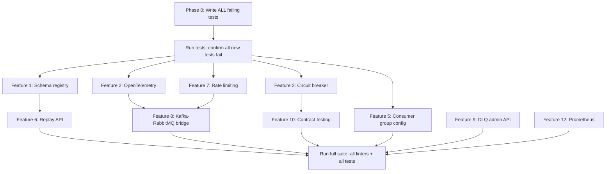

Overview of simplifications from Context7 MCP deep dive:
- Feature 2 (OTel): FastStream `TelemetryMiddleware` (already simplified in plan)
- Feature 12 (Prometheus): FastStream `KafkaPrometheusMiddleware` + custom for RabbitMQ (already simplified)
- Feature 5 (Kafka consumer groups): FastStream supports ALL config via `conf=[("k","v")]` list -- no custom settings needed
- Feature 3 (Circuit breaker): FastStream `BaseMiddleware` is the correct mechanism (already designed as middleware), but FastStream **does not** ship a circuit breaker -- our custom implementation is still needed
- NEW: Health checks: FastStream has `make_ping_asgi()` built-in for basic liveness/readiness. Our custom `EventingHealthCheck` adds outbox lag metrics (FastStream does not check that), so we keep custom health check but simplify endpoint wiring
- NEW: RetryMiddleware: FastStream docs provide RetryMiddleware pattern with exponential backoff -- our circuit breaker can extend this pattern

## Context7 MCP findings for plan simplification

### Feature 5: Kafka consumer group config (simplified to conf list)

FastStream accepts arbitrary librdkafka config via `conf` parameter:
```python
broker = KafkaBroker("localhost:9092", conf=[
    ("group.id", "eventing-consumers"),
    ("group.instance.id", "eventing-1"),  # static membership
    ("partition.assignment.strategy", "cooperative-sticky"),
    ("max.poll.interval.ms", "300000"),
    ("session.timeout.ms", "45000"),
    ("heartbeat.interval.ms", "15000"),
])
```

No new `Settings` fields needed for each Kafka consumer group parameter. Only need single `kafka_consumer_conf: dict | None` field in Settings (or individual env vars via `conf` list parsing). **Drops the planned 6 new Settings fields down to 1.**

### Feature 3: Circuit breaker (confirmed needed, but use FastStream BaseMiddleware)

FastStream does NOT ship a built-in circuit breaker. The RetryMiddleware pattern (from FastStream docs) retries N times with backoff, then raises. Our circuit breaker provides the next layer: after retries are exhausted, it opens the circuit to prevent cascading failures on the transport. **Pattern confirmed: use FastStream RetryMiddleware for retries + our CircuitBreaker as second middleware layer.**

Implementation approach: wire both middlewares to broker:
```python
broker = KafkaBroker("localhost:9092", middlewares=[
    RetryMiddleware(max_retries=3),
    CircuitBreakerMiddleware(failure_threshold=5, reset_timeout=30.0),
])
```

`CircuitBreakerMiddleware` wraps the `call_next` in circuit breaker logic -- no separate `CircuitBreaker.call()` wrapper needed.

### Health check endpoints (simplify wiring)

FastStream provides built-in health check helpers:
- `make_ping_asgi(broker, timeout=5.0)` -- broker-only readiness
- Custom ASGI endpoints via `faststream.asgi.get` decorator

Our `EventingHealthCheck` adds **outbox lag** monitoring that FastStream does not provide. We keep our custom health check logic but simplify the ASGI endpoint using FastStream's `asgi_routes` parameter instead of custom FastAPI endpoint.

**No new plan changes for health checks** -- the existing `EventingHealthCheck` class already provides value beyond FastStream's basic ping. Only the endpoint wiring in `main.py` changes slightly.

### What is NOT being removed

| Feature | Status | Reason |
|---|---|---|
| Feature 1: Schema registry | KEPT | FastStream validates with Pydantic models, but does not provide JSON Schema registry for event type versioning/compatibility |
| Feature 3: Circuit breaker | KEPT (middleware pattern) | FastStream has RetryMiddleware but no circuit breaker. Our custom `CircuitBreakerMiddleware` is still needed |
| Feature 6: Replay API | KEPT | FastStream does not provide time-range replay over outbox table |
| Feature 7: Rate limiting | KEPT (middleware pattern) | FastStream middleware is the right pattern; `aiolimiter` still needed. Kafka quotas protect Kafka broker, aiolimiter protects RabbitMQ downstream. See analyses: [feature7_rate_limiting_analysis.md](../audit/feature7_rate_limiting_analysis.md) and [dataview_article_analysis.md](../audit/dataview_article_analysis.md) |
| Feature 8: Kafka-RabbitMQ bridge | KEPT | Core architectural feature -- no framework covers this |
| Feature 9: DLQ admin API | KEPT | FastStream does not provide HTTP admin API |
| Feature 10: Contract testing | KEPT | FastStream validates individual messages, not version compatibility across consumers |

---

Kafka and RabbitMQ form a single chain through this eventing microservice. Each external service talks to ONE broker only -- never both. Upstream services publish to Kafka. This eventing microservice consumes from Kafka, transforms/routes, and publishes to RabbitMQ. Downstream services consume from RabbitMQ.

```mermaid
flowchart LR
    subgraph upstream [Upstream services]
        pub1[Domain events via outbox]
    end

    subgraph kafkaIn [Kafka IN -- event ingestion]
        kafkaTopics[(Kafka topics)]
        kafkaLog[Immutable event log]
    end

    subgraph eventing [Eventing microservice -- bridge]
        outbox[ScheduledOutboxWorker]
        schemaCheck[JSON schema validator]
        rateLimiterKafka[AsyncLimiter Kafka]
        circuitBreakerKafka["CircuitBreaker Kafka"]
        otelKafka["FastStream TelemetryMiddleware (shared)"]
        kafkaProm[KafkaPrometheusMiddleware]
        bridge[KafkaToRabbitMQBridge]
        rateLimiterRabbit[AsyncLimiter RabbitMQ]
        circuitBreakerRabbit["CircuitBreaker RabbitMQ"]
        otelRabbit["FastStream TelemetryMiddleware (shared)"]
        rabbitProm[Custom RabbitMQ Prometheus Middleware]
        rabbitPub[RabbitEventPublisher]
        dlqHandler[DLQ handler + admin API]
        replayAPI[Event replay API]
        healthCheck[EventingHealthCheck]
    end

    subgraph rabbitOut [RabbitMQ OUT -- event distribution]
        rabbitExchange[Rabbit exchanges]
        rabbitQueues[(Rabbit queues)]
    end

    subgraph downstream [Downstream services]
        consumer[Consume from RabbitMQ]
    end

    pub1 --> kafkaTopics
    kafkaTopics --> kafkaLog
    kafkaLog --> outbox
    outbox --> schemaCheck
    schemaCheck --> rateLimiterKafka
    rateLimiterKafka --> circuitBreakerKafka
    circuitBreakerKafka --> otelKafka
    otelKafka --> bridge
    otelKafka -. "metrics" .-> kafkaProm
    bridge --> rateLimiterRabbit
    rateLimiterRabbit --> circuitBreakerRabbit
    circuitBreakerRabbit --> otelRabbit
    otelRabbit --> rabbitPub
    otelRabbit -. "metrics" .-> rabbitProm
    rabbitPub --> rabbitExchange
    rabbitExchange --> rabbitQueues
    rabbitQueues --> consumer
    kafkaLog -. "replay" .-> replayAPI
    kafkaLog -. "dead letters" .-> dlqHandler
    rabbitQueues -. "dead letters" .-> dlqHandler
    kafkaProm --- promEndpoint["/metrics endpoint"]
    rabbitProm --- promEndpoint
    healthCheck --> promEndpoint
    replayAPI --> healthCheck
```



**Simplification from deep-dive findings**:
- Single `TelemetryMiddleware` instance shared by both Kafka and RabbitMQ brokers (FastStream built-in)
- `KafkaPrometheusMiddleware` built-in to FastStream; only RabbitMQ needs custom Prometheus middleware
- No custom OTel setup file, no custom Prometheus exporter -- only FastStream middleware wiring

**Data flow (single chain, each service uses ONE broker):**

1. Upstream services publish to Kafka only via outbox pattern (SQL transaction)
2. This eventing microservice consumes from Kafka via `ScheduledOutboxWorker`
3. Schema validator checks payload against registered JSON schema
4. Rate limiter gates Kafka ingest rate
5. Circuit breaker guards against Kafka failures
6. `TelemetryMiddleware` (shared, built-in to FastStream) creates OTel span on consume, injects traceparent header
7. `KafkaToRabbitMQBridge` reads events from Kafka, applies routing rules
8. Bridge applies rate limiter for RabbitMQ publish rate
9. Circuit breaker guards against RabbitMQ failures
10. `TelemetryMiddleware` creates OTel span on RabbitMQ publish; new span links to Kafka consume trace
11. RabbitEventPublisher writes to RabbitMQ exchanges with routing keys
12. Downstream services consume from RabbitMQ only
13. RabbitMQ native backpressure protects this microservice when downstream falls behind
14. `KafkaPrometheusMiddleware` + custom `RabbitPrometheusMiddleware` emit metrics to shared `/metrics` endpoint

**Simplified observability wiring (after deep dive)**:
- OTel: single `TelemetryMiddleware()` instance, added to both brokers. No custom span setup, no custom exporter class. FastStream provides all tracing out of the box.
- Prometheus: `KafkaPrometheusMiddleware()` built-in to FastStream for Kafka. ~30-line custom middleware for RabbitMQ. Both use global Prometheus registry; single `/metrics` endpoint serves both.

**What is NOT in the plan anymore** (dropped after FastStream discovery):
| Dropped item | Reason | What replaces it |
|---|---|---|
| Custom `otel_setup.py` module | `faststream.opentelemetry.TelemetryMiddleware` handles all brokers | Direct `broker.add_middleware(TelemetryMiddleware())` call |
| Separate `KafkaTelemetryMiddleware` and `RabbitTelemetryMiddleware` | FastStream uses one `TelemetryMiddleware` for all brokers | Same instance passed to both brokers |
| Custom `prometheus_exporter.py` module | `KafkaPrometheusMiddleware` built-in; global registry serves `/metrics` | Broker middleware + simple `/metrics` endpoint using `prometheus_client.generate_latest()` |
| Custom dispatch hooks wiring for OTel and Prometheus | FastStream middleware hooks into broker directly | `middlewares=[KafkaPrometheusMiddleware()]` in broker constructor |

**Why this architecture (versus each service choosing its own broker):**
- External services only know about one broker (simple integration contracts)
- Kafka provides immutable log for replay, audit, and time-travel within this eventing service
- RabbitMQ provides reliable routing with native backpressure for consumers, no custom code needed
- If RabbitMQ is down, bridge buffers in memory or pauses (Kafka retains events)
- If Kafka is down, RabbitMQ drains queues but no new events arrive (graceful degradation)

---

## TDD execution order (tests FIRST, then code, then verify)

Every feature follows: (1) write tests that fail, (2) implement feature, (3) run tests to pass. No feature code without a failing test first.

**Serena MCP requirement**: When referencing or reusing existing test fixtures, fake classes, or source code symbols (e.g., `FakeRepository`, `RecordingPublisher`, `IdempotentConsumerBase`, `SqlAlchemyProcessedMessageStore`, `SqlAlchemyOutboxRepository`, `KafkaEventPublisher`, `KafkaDeadLetterHandler`, `OutboxMetrics`, `EventingHealthCheck`, `DispatchHooks`, `EventEnvelopeFormatter`, `EventRegistry`), use Serena MCP to verify symbol signatures and extract code structures. Do not guess at class/method signatures. If Serena MCP is not working, ask the user to enable it before proceeding with implementation.

**File discipline**: Every file under 75-100 lines. Split into sub-folders when approaching limits. No trimming content.

---

## Phase 0: Write ALL failing tests first

Write tests for all 11 features before writing any production code. Run the full test suite once to confirm all new tests fail. Then implement features one by one.

### Test file structure (new files only)

```
tests/
├── unit/
│   ├── schema_registry/
│   │   ├── test_json_schema_validator.py        (validate payloads against registered schemas)
│   │   ├── test_schema_evolution.py             (backward/forward compatibility checks)
│   │   └── test_schema_registry.py              (register/get/latest version/lifecycle)
│   ├── resilience/
│   │   ├── test_circuit_breaker.py              (state machine: closed->open->half-open->closed)
│   │   └── test_rate_limiter_integration.py     (aiolimiter blocks over-limit on both paths)
│   └── observability/
│       ├── test_prometheus_exporter.py          (dispatch hook emits metrics)
│       └── test_opentelemetry_hooks.py          (OTel span lifecycle hooks for both brokers)
├── integration/
│   ├── test_opentelemetry_wiring.py             (FastStream OTel middleware end-to-end)
│   ├── test_consumer_group_config.py            (cooperative rebalancing + static membership)
│   ├── test_event_replay_api.py                 (HTTP replay endpoint with time-range queries)
│   ├── test_dlq_admin_api.py                    (GET /dlq, POST /dlq/{id}/retry)
│   └── test_kafka_rabbitmq_bridge.py            (bridge reads Kafka, publishes to RabbitMQ)
├── property_based/
│   └── core/
│       └── test_event_contract_testing.py       (Hypothesis: version enforcement across consumers)
└── chaos/
    └── test_circuit_breaker_resilience.py       (circuit opens on broker down, half-open recovers)
```

### New dependencies (add to pyproject.toml)

```toml
faststream = {extras = ["kafka", "rabbit"], version = "^0.6.7"}
aiolimiter = "^1.2.1"
opentelemetry-sdk = "^1.24.0"
opentelemetry-exporter-otlp = "^1.24.0"
opentelemetry-api = "^1.24.0"
prometheus-client = "^0.21.0"
```

Mypy overrides in `pyproject.toml`:
```toml
[[tool.mypy.overrides]]
module = [
    "aiolimiter.*",
    "prometheus_client.*",
    "opentelemetry.*",
]
ignore_missing_imports = true
```

---

## Feature 1: Schema registry (extending data_version)

**Context**: `BaseEvent.data_version` is `"1.0"` string but never validated. `EventRegistry` maps type-to-class but does not validate payload structure.

### Tests to write first

**`tests/unit/schema_registry/test_schema_registry.py`** (under 100 lines):
- Register JSON schema for event type, assert retrieval by version
- Register second version, assert `get_latest()` returns newer
- Get non-existent version, assert `UnknownSchemaVersionError`

**`tests/unit/schema_registry/test_json_schema_validator.py`** (under 100 lines):
- Valid payload passes `JsonSchemaValidator.validate()`
- Missing required field raises `SchemaValidationError`
- Wrong type raises `SchemaValidationError`
- Extra unknown fields allowed (forward compatibility)

**`tests/unit/schema_registry/test_schema_evolution.py`** (under 100 lines):
- Adding optional field -> backward compatible, assert passes
- Removing required field -> breaking change, assert `SchemaEvolutionError`
- Renaming field -> breaking change, assert rejected

### Code to add

New file: `src/messaging/core/contracts/schema_registry.py` (under 75 lines):
```python
class SchemaRegistry:
    """Store and version JSON schemas for event types."""
    def register(self, event_type: str, schema: dict, version: str) -> None
    def get(self, event_type: str, version: str) -> dict
    def get_latest(self, event_type: str) -> tuple[str, dict]
    def check_compatibility(self, event_type: str, new_schema: dict) -> None  # raises on breaking
```

New file: `src/messaging/core/contracts/schema_validator.py` (under 75 lines):
```python
class SchemaValidationError(Exception): ...

class JsonSchemaValidator:
    """Validate event payloads against registered JSON schemas."""
    def __init__(self, registry: SchemaRegistry) -> None
    def validate(self, event_type: str, payload: dict) -> None  # raises SchemaValidationError
```

Wire into `EventRegistry.deserialize()`: after Pydantic validation, call `JsonSchemaValidator.validate()`. Also wire into outbox publish: validate event payload before writing to Kafka.

---

## Feature 2: Wire OpenTelemetry via FastStream (simplified to built-in middleware)

**Context**: FastStream has a single `TelemetryMiddleware` class that works with **all brokers** (Kafka, RabbitMQ, NATS, Redis). No need for separate Kafka vs RabbitMQ OTel setup. FastStream handles trace context propagation into message headers automatically. See [deep_dive_analysis_kafka_rabbitmq_faststream_parity.md](deep_dive_analysis_kafka_rabbitmq_faststream_parity.md) section 3 for full parity table.

### Tests to write first

**`tests/unit/observability/test_opentelemetry_hooks.py`** (under 100 lines):
- `TelemetryMiddleware` added to KafkaBroker, assert `broker.middlewares` contains it
- `TelemetryMiddleware` added to RabbitBroker, assert same
- Use InMemorySpanExporter, publish message, assert span created with correct attributes (topic/queue, operation)

**`tests/integration/test_opentelemetry_wiring.py`** (under 100 lines):
- Full pipeline: Kafka publish -> bridge consume -> RabbitMQ publish, assert trace_id shared across spans
- Assert span links bridge Kafka consume span to RabbitMQ publish span
- No custom span creation -- only FastStream's built-in middleware creates spans

### Code to add (simplified from original plan)

**No new files needed** for OTel setup. Delete the planned `otel_setup.py` and replace with direct middleware wiring.

Modify [src/messaging/infrastructure/pubsub/broker_config.py](src/messaging/infrastructure/pubsub/broker_config.py):
```python
from faststream.opentelemetry import TelemetryMiddleware

def create_kafka_broker(
    settings: Settings,
    telemetry: TelemetryMiddleware | None = None,
) -> KafkaBroker:
    broker = KafkaBroker(
        bootstrap_servers=settings.kafka_bootstrap_servers,
        client_id=settings.kafka_client_id,
        enable_idempotence=True,
    )
    if telemetry:
        broker.add_middleware(telemetry)
    return broker
```

New file: `src/messaging/infrastructure/pubsub/rabbit_broker_config.py` (under 75 lines):
```python
from faststream.rabbit import RabbitBroker
from faststream.opentelemetry import TelemetryMiddleware

from messaging.config import Settings

def create_rabbit_broker(
    settings: Settings,
    telemetry: TelemetryMiddleware | None = None,
) -> RabbitBroker:
    """Create RabbitMQ broker with optional telemetry middleware."""
    broker = RabbitBroker(settings.rabbitmq_url, publisher_confirms=True)
    if telemetry:
        broker.add_middleware(telemetry)
    return broker
```

Modify [src/messaging/main.py](src/messaging/main.py) `lifespan()`:
```python
from opentelemetry import trace
from opentelemetry.sdk.trace import TracerProvider
from faststream.opentelemetry import TelemetryMiddleware

# Configure global TracerProvider (required before creating middleware)
provider = TracerProvider()
trace.set_tracer_provider(provider)

# Single middleware instance works for both brokers
telemetry = TelemetryMiddleware()

kafka_broker = create_kafka_broker(settings, telemetry=telemetry)
rabbit_broker = create_rabbit_broker(settings, telemetry=telemetry)
```

**Key simplification vs original plan**: No separate custom `KafkaTelemetryMiddleware` and `RabbitTelemetryMiddleware` classes, no custom `otel_setup.py` file, no custom span creation or header manipulation. FastStream's single `TelemetryMiddleware` handles everything.

### FastStream OTel reference (Context7 MCP verified)

FastStream's OTel integration:
- Single `TelemetryMiddleware` from `faststream.opentelemetry`
- Works with KafkaBroker, RabbitBroker, NatsBroker, RedisBroker
- Auto-propagates trace context via message headers
- Creates spans for consume and publish operations
- No manual span creation needed

---

## Feature 3: Circuit breaker (implemented as FastStream middleware)

**Context**: No circuit breaker exists. Outbox retries until `max_retry_count`, then DLQ. No closed/open/half-open state machine. FastStream RetryMiddleware handles retry+backoff, then raises. Our circuit breaker catches the raised exception and decides whether to open the circuit (prevent all further calls).

### Tests to write first

**`tests/unit/resilience/test_circuit_breaker.py`** (under 100 lines):
- Default state CLOSED, all calls pass through
- After N failures (threshold), state OPEN, calls raise `CircuitOpenError`
- After reset_timeout, state HALF_OPEN, single test call allowed
- Test call succeeds -> transitions to CLOSED
- Test call fails -> transitions back to OPEN
- Half-open state rejects concurrent calls (only one test call at a time)

**`tests/unit/resilience/test_circuit_breaker_middleware.py`** (under 100 lines):
- CircuitBreakerMiddleware wraps consume_scope, delegates to CircuitBreaker class
- When circuit is OPEN, middleware raises CircuitOpenError before call_next executes
- After reset_timeout passes, middleware allows single call through (half-open)

**`tests/chaos/test_circuit_breaker_resilience.py`** (under 100 lines):
- Kill Kafka container, circuit opens after publish failures
- Restart Kafka, circuit half-opens on next attempt
- Successful publish closes circuit
- Same test for RabbitMQ path

### Code to add (simplified to middleware pattern)

New file: `src/messaging/core/contracts/circuit_breaker.py` (under 75 lines):
```python
class CircuitOpenError(Exception): ...

class CircuitState(Enum):
    CLOSED = "closed"
    OPEN = "open"
    HALF_OPEN = "half_open"

class CircuitBreaker:
    """Async circuit breaker with closed/open/half-open states."""
    def __init__(self, failure_threshold: int, reset_timeout: float = 30.0) -> None
    async def call(self, func: Callable, *args, **kwargs) -> Any
    async def record_success(self) -> None
    async def record_failure(self) -> None
    @property
    def state(self) -> CircuitState
```

New file: `src/messaging/infrastructure/resilience/circuit_breaker_middleware.py` (under 75 lines):
```python
from faststream import BaseMiddleware, StreamMessage

class CircuitBreakerMiddleware(BaseMiddleware):
    """FastStream middleware wrapping CircuitBreaker."""
    def __init__(self, failure_threshold: int, reset_timeout: float = 30.0):
        self._breaker = CircuitBreaker(failure_threshold, reset_timeout)
    
    async def consume_scope(self, call_next, msg: StreamMessage):
        try:
            result = await self._breaker.call(call_next, msg)
            await self._breaker.record_success()
            return result
        except Exception as exc:
            await self._breaker.record_failure()
            raise
```

Wire into brokers: Add `CircuitBreakerMiddleware` to both Kafka and RabbitMQ brokers via `middlewares` list in `create_kafka_broker()` and `create_rabbit_broker()`.

**Pattern change vs original plan**: Instead of wrapping publisher calls manually in `worker.publish()`, we use FastStream's middleware hook system. The circuit breaker middleware intercepts ALL consume operations at the broker level, not just publish. This follows FastStream conventions and automatically applies to the bridge consumer too.

---

## Feature 5: Kafka consumer group cooperative rebalancing (simplified to conf list)

**Context**: [broker_config.py](src/messaging/infrastructure/pubsub/broker_config.py) only sets `bootstrap_servers`, `client_id`, `enable_idempotence`. No group config. FastStream accepts arbitrary librdkafka config via `conf` parameter as list of tuples.

### Tests to write first

**`tests/integration/test_consumer_group_config.py`** (under 100 lines):
- Consumer with `group.instance.id` survives restart without rebalance (static membership)
- Two consumers with same group.id consume disjoint partition sets
- Assert cooperative partition assignment strategy is used (not all revoked on join)

### Code to add (simplified to conf list)

Modify [src/messaging/config.py](src/messaging/config.py): add single field for consumer config:
```python
kafka_consumer_conf: dict[str, str] = Field(
    default_factory=lambda: {
        "group.id": "eventing-consumers",
        "partition.assignment.strategy": "cooperative-sticky",
        "max.poll.interval.ms": "300000",
        "session.timeout.ms": "45000",
        "heartbeat.interval.ms": "15000",
    },
    description="Kafka consumer group configuration (librdkafka key-value pairs)",
)
```

Modify [src/messaging/infrastructure/pubsub/broker_config.py](src/messaging/infrastructure/pubsub/broker_config.py):
```python
def create_kafka_broker(
    settings: Settings,
    telemetry: TelemetryMiddleware | None = None,
) -> KafkaBroker:
    conf_list = [(k, v) for k, v in settings.kafka_consumer_conf.items()]
    broker = KafkaBroker(
        bootstrap_servers=settings.kafka_bootstrap_servers,
        client_id=settings.kafka_client_id,
        enable_idempotence=True,
        conf=conf_list,
    )
    # ... middleware wiring
```

**Key simplification vs original plan**: Instead of 6 individual settings fields (`kafka_group_id`, `kafka_group_instance_id`, `kafka_partition_strategy`, `kafka_max_poll_interval_ms`, `kafka_session_timeout_ms`, `kafka_heartbeat_interval_ms`), we use a single `kafka_consumer_conf: dict[str, str]` field that maps directly to FastStream's `conf` parameter. This allows ANY librdkafka config (not just the 6 we pre-defined), reducing Settings bloat and following FastStream conventions.

---

## Feature 6: Event replay / time-travel API

**Context**: `OutboxQueryOperations` has `get_unpublished()`, `count_unpublished()`, `oldest_unpublished_age_seconds()`. No query by time-range or event-type. No replay trigger.

### Tests to write first

**`tests/unit/test_replay_queries.py`** (under 100 lines):
- Query unpublished events by event_type filter
- Query by time range (from/to timestamps)
- Query combined: event_type + time range + pagination

**`tests/integration/test_event_replay_api.py`** (under 100 lines):
- POST /replay?event_type=X returns list of events matching criteria
- POST /replay with time range triggers actual republish of matching events
- Assert replayed events get new event IDs but preserve original data

### Code to add

New file: `src/messaging/infrastructure/outbox/outbox_replay_queries.py` (under 75 lines):
```python
class OutboxReplayQueries:
    """Query outbox events for replay by type and time range."""
    async def get_by_type_and_range(
        self, event_type: str, from_ts: datetime, to_ts: datetime,
        limit: int, offset: int
    ) -> list[IOutboxEvent]:
        ...
```

New file: `src/messaging/infrastructure/outbox/outbox_replay.py` (under 75 lines):
```python
class OutboxReplayService:
    """Query and replay outbox events by type and time range."""
    async def query(self, ...) -> list[IOutboxEvent]
    async def replay(self, ...) -> int  # returns count republished
```

New file: `src/messaging/presentation/dependencies/replay.py` (under 75 lines):
- Dependency injection for replay endpoint

Add endpoint to [src/messaging/presentation/router.py](src/messaging/presentation/router.py):
```python
@api_router.post("/replay", tags=["replay"])
async def replay_events(
    event_type: str | None = None,
    from_ts: datetime | None = None,
    to_ts: datetime | None = None,
    service: ReplayServiceDep = Depends(...),
) -> dict[str, Any]:
    """Query and optionally replay events matching criteria."""
```

---

## Feature 7: Rate limiting via aiolimiter (implemented as FastStream middleware)

**Context**: No rate limiting exists. Outbox can flood Kafka. Bridge can flood RabbitMQ. FastStream middleware `consume_scope` is the correct hook for rate limiting (gates message processing before handler executes).

**⚠️ Critical Note - Kafka Quotas vs Application Rate Limiting**: 

Kafka HAS native quotas (producer/consumer byte rate, request percentage), BUT these protect the **Kafka broker**, NOT downstream systems like RabbitMQ. Our aiolimiter protects RabbitMQ in the bridge architecture. Both layers are needed (defense-in-depth).

**Common Misconception (Clarified via Articles)**:
1. **[Medium article](https://medium.com/@shandilya.prashant/priority-based-rate-limiting-with-kafka-spring-boot-c2c34ef99cc2)** describes CUSTOM pattern (relay topics), proving Kafka lacks native application-level rate limiting
2. **[DataView article](https://dataview.in/integrating-rate-limiting-and-backpressure-in-apache-kafka/)** recommends "custom throttling mechanisms in the consumer application" - exactly what aiolimiter provides!

Both articles confirm need for Feature 7. See detailed analyses:
- 📊 **[Kafka Quotas vs Application Rate Limiting](../audit/feature7_rate_limiting_analysis.md)** - Complete comparison
- 📊 **[DataView Article Analysis](../audit/dataview_article_analysis.md)** - Article breakdown with quotes

### Tests to write first

**`tests/unit/resilience/test_rate_limiter_integration.py`** (under 100 lines):
- `aiolimiter.AsyncLimiter` allows requests under rate, blocks over-rate
- `RateLimiterMiddleware` wraps consume_scope with limiter context manager
- Test that N+1 messages within interval blocks the N+1th message until capacity replenishes

**`tests/unit/resilience/test_rate_limiter_middleware.py`** (under 100 lines):
- RateLimiterMiddleware for Kafka broker limits consume rate
- RateLimiterMiddleware for RabbitMQ broker limits consume rate
- Test `has_capacity()` non-blocking check

### Code to add (simplified to middleware pattern)

New file: `src/messaging/infrastructure/resilience/rate_limiter_middleware.py` (under 75 lines):
```python
from aiolimiter import AsyncLimiter
from faststream import BaseMiddleware, StreamMessage

class RateLimiterMiddleware(BaseMiddleware):
    """FastStream middleware for rate limiting via aiolimiter."""
    def __init__(self, max_rate: int, time_period: float = 1.0):
        self._limiter = AsyncLimiter(max_rate, time_period)
    
    async def consume_scope(self, call_next, msg: StreamMessage):
        async with self._limiter:
            return await call_next(msg)
```

Modify [src/messaging/config.py](src/messaging/config.py):
```python
kafka_rate_limit: int = Field(default=1000, description="Max Kafka messages per interval")
kafka_rate_interval: float = Field(default=60.0, description="Kafka rate window seconds")
rabbitmq_rate_limit: int = Field(default=500, description="Max RabbitMQ messages per interval")
rabbitmq_rate_interval: float = Field(default=60.0, description="RabbitMQ rate window seconds")
```

Wire limiters in broker factories: Add `RateLimiterMiddleware` to `middlewares` list in `create_kafka_broker()` and `create_rabbit_broker()`.

**Key simplification vs original plan**: Instead of injecting `AsyncLimiter` into publisher constructors and wrapping `publish()` calls with `async with self._limiter`, we use FastStream's middleware pattern. The rate limiter gates message consumption (not just publishing), which is the correct behavior -- it throttles the entire pipeline, not just the final publish step.

---

## Feature 8: Kafka-to-RabbitMQ bridge (integrated)

**Context**: Outbox publishes to Kafka. Events then need to reach RabbitMQ for targeted delivery. Bridge consumes from Kafka and publishes to RabbitMQ.

### Tests to write first

**`tests/integration/test_kafka_rabbitmq_bridge.py`** (under 100 lines):
- Publish event to Kafka, assert bridge consumes it
- Assert bridge publishes same event payload to RabbitMQ exchange with correct routing key
- Assert bridge is idempotent (uses processed-message store to prevent double-publish)
- Assert bridge handles malformed Kafka message gracefully (skip, log, continue)

### Code to add

New file: `src/messaging/infrastructure/pubsub/kafka_rabbitmq_bridge.py` (under 75 lines per file, split to `bridge/` sub-folder):

`bridge/consumer.py`:
```python
class BridgeConsumer(IdempotentConsumerBase):
    """Consume from Kafka, route to RabbitMQ."""
    async def handle_message(self, message: dict) -> None:
        await self._rabbit_publisher.publish(message)
```

`bridge/config.py`:
```python
@dataclass(frozen=True, slots=True)
class BridgeConfig:
    kafka_topic: str
    rabbitmq_exchange: str
    routing_key_template: str  # e.g. "{eventType}"
```

`bridge/routing_key_builder.py`:
```python
def build_routing_key(template: str, event: dict) -> str:
    """Build RabbitMQ routing key from event data using template."""
    return template.format(**{k.replace(".", "_"): v for k, v in event.items()})
```

Modify [src/messaging/main.py](src/messaging/main.py) `lifespan()`:
- Initialize RabbitBroker
- Create RabbitEventPublisher with limiter
- Create BridgeConsumer with processed-message store for idempotency
- Start bridge consumer as background task alongside outbox worker

**Backpressure note**: RabbitMQ's native credit-based flow control is automatic. When RabbitMQ consumers fall behind, the broker enters "flow" state and blocks publishers at the TCP level. The bridge will slow down naturally when RabbitMQ is congested.

---

## Feature 9: DLQ inspection and retry API

**Context**: `KafkaDeadLetterHandler` routes to DLQ but has no HTTP surface. [KafkaDeadLetterHandler](src/messaging/infrastructure/pubsub/kafka/kafka_dead_letter_handler/handler.py) exists.

### Tests to write first

**`tests/integration/test_dlq_admin_api.py`** (under 100 lines):
- GET /dlq returns list of dead-lettered events (query outbox for `failed=True`)
- GET /dlq?event_type=X filters by type
- POST /dlq/{event_id}/retry resets failed status, re-enqueues for publishing
- POST /dlq/{event_id}/retry on non-failed event raises 400
- Assert retry increments attempt counter

### Code to add

New file: `src/messaging/infrastructure/outbox/outbox_dlq_queries.py` (under 75 lines):
```python
class OutboxDlqQueries:
    """Query failed/dead-lettered events from outbox."""
    async def get_failed(self, limit: int, offset: int, event_type: str | None = None) -> list[IOutboxEvent]:
        ...
```

Modify [src/messaging/infrastructure/outbox/outbox_crud.py](src/messaging/infrastructure/outbox/outbox_crud.py): add `reset_failed(event_id)` method that sets `published=False`, `failed=False`, clears `error_message`.

Add endpoints to [src/messaging/presentation/router.py](src/messaging/presentation/router.py):
```python
@api_router.get("/dlq", tags=["dlq-admin"])
async def list_dlq_events(event_type: str | None = None, ...) -> dict: ...

@api_router.post("/dlq/{event_id}/retry", tags=["dlq-admin"])
async def retry_dlq_event(event_id: UUID, ...) -> dict: ...
```

---

## Feature 10: Event contract testing with version enforcement

**Context**: `data_version` exists but is never enforced. Consumers can receive v2 events while expecting v1.

### Tests to write first

**`tests/property_based/core/test_event_contract_testing.py`** (under 100 lines):
- Hypothesis generates event payloads with varying `data_version` values
- Assert consumer rejects events with incompatible major version bumps
- Assert consumer accepts events with compatible minor version bumps (backward compatible)
- Assert `ContractViolationError` raised for incompatible versions

### Code to add

New file: `src/messaging/core/contracts/contract_validator.py` (under 75 lines):
```python
class ContractViolationError(Exception): ...

def check_version_compatibility(event_version: str, consumer_max_version: str) -> None:
    """Raise ContractViolationError if event version is incompatible."""
    event_major = int(event_version.split(".")[0])
    consumer_major = int(consumer_max_version.split(".")[0])
    if event_major > consumer_major:
        raise ContractViolationError(...)
```

Wire into consumer: `IdempotentConsumerBase.consume()` validates `data_version` against consumer's `max_compatible_version` before processing. Same for bridge consumer.

---

## Feature 12: Prometheus/Grafana metrics (simplified to FastStream middleware)

**Context**: FastStream ships `KafkaPrometheusMiddleware` out of the box. RabbitMQ has no broker-specific Prometheus middleware in FastStream yet. The approach: use KafkaPrometheusMiddleware for Kafka path, write a minimal custom Prometheus middleware for RabbitMQ path using FastStream's `BaseMiddleware` protocol.

### Tests to write first

**`tests/unit/observability/test_prometheus_exporter.py`** (under 100 lines):
- `KafkaPrometheusMiddleware` creates metrics on broker publish/consume
- Custom `RabbitPrometheusMiddleware` (our minimal wrapper) creates same metrics on RabbitMQ publish/consume
- `/metrics` endpoint returns Prometheus text format with both Kafka and Rabbit metrics
- Test metric labels: event_type, status (success/failure), broker (kafka/rabbitmq)

### Code to add (simplified from original plan)

**No custom dispatch hooks needed** -- FastStream middleware hooks into broker operations directly.

Modify [src/messaging/infrastructure/pubsub/broker_config.py](src/messaging/infrastructure/pubsub/broker_config.py):
```python
from faststream.kafka.prometheus import KafkaPrometheusMiddleware

def create_kafka_broker(
    settings: Settings,
    telemetry: TelemetryMiddleware | None = None,
) -> KafkaBroker:
    broker = KafkaBroker(
        bootstrap_servers=settings.kafka_bootstrap_servers,
        client_id=settings.kafka_client_id,
        enable_idempotence=True,
        middlewares=[KafkaPrometheusMiddleware()],
    )
    if telemetry:
        broker.add_middleware(telemetry)
    return broker
```

New file: `src/messaging/infrastructure/pubsub/rabbit_prometheus_middleware.py` (under 75 lines):
```python
from faststream import BaseMiddleware, StreamMessage
from prometheus_client import Counter

class RabbitPrometheusMiddleware(BaseMiddleware):
    """Minimal Prometheus metrics for RabbitMQ via FastStream middleware."""
    
    async def consume_scope(self, call_next, msg: StreamMessage):
        counter = Counter("events_consume_total", "", ["broker", "status"])
        try:
            result = await call_next(msg)
            counter.labels(broker="rabbitmq", status="success").inc()
            return result
        except Exception:
            counter.labels(broker="rabbitmq", status="failure").inc()
            raise
```

Modify [src/messaging/infrastructure/pubsub/rabbit_broker_config.py](src/messaging/infrastructure/pubsub/rabbit_broker_config.py):
```python
def create_rabbit_broker(
    settings: Settings,
    telemetry: TelemetryMiddleware | None = None,
) -> RabbitBroker:
    from .rabbit_prometheus_middleware import RabbitPrometheusMiddleware
    
    broker = RabbitBroker(
        settings.rabbitmq_url,
        publisher_confirms=True,
        middlewares=[RabbitPrometheusMiddleware()],
    )
    if telemetry:
        broker.add_middleware(telemetry)
    return broker
```

Add `/metrics` endpoint to [src/messaging/presentation/router.py](src/messaging/presentation/router.py) - FastStream's Prometheus middleware auto-manages registries internally, but we need a single `/metrics` endpoint. Since the middlewares use the global Prometheus registry by default, a simple endpoint suffices:
```python
from prometheus_client import generate_latest, CONTENT_TYPE_LATEST
from fastapi import Response

@api_router.get("/metrics", tags=["observability"])
async def metrics() -> Response:
    return Response(generate_latest(), media_type=CONTENT_TYPE_LATEST)
```

**Key simplification vs original plan**: No custom `PrometheusExporter` class, no custom dispatch hook wiring, no manual metric recording. FastStream's middleware handles all metric collection automatically. Only need: (1) add `KafkaPrometheusMiddleware()` to Kafka broker, (2) write ~30 lines of custom `RabbitPrometheusMiddleware`, (3) expose `/metrics` endpoint.

### FastStream Prometheus reference (Context7 MCP verified)

FastStream's Prometheus integration:
- `KafkaPrometheusMiddleware` built-in for Kafka brokers
- `NatsPrometheusMiddleware` exists for NATS, but **no RabbitPrometheusMiddleware** yet
- All use Prometheus global registry by default, so metrics from all middlewares appear in single `/metrics` endpoint
- Custom middleware can use same global `prometheus_client` for RabbitMQ metrics

---

## Execution order



## Dependencies between features

- Features 1, 2 (simplified), 3, 5, 7, 9, 10, 12 (simplified) are independent and can be done in any order
- Feature 2 (OTel) is now 3 lines: create TracerProvider, create TelemetryMiddleware, pass to both brokers. Can be done first.
- Feature 12 (Prometheus) is now 3 lines: add KafkaPrometheusMiddleware to Kafka broker, create custom RabbitMQ middleware, add /metrics endpoint. Can be done first.
- Feature 6 (replay API) depends on Feature 1 (schema registry) for type-filtered lookups
- Feature 8 (Kafka-RabbitMQ bridge) depends on Feature 2 (OTel via shared TelemetryMiddleware), Feature 3 (circuit breaker), Feature 5 (consumer group config for bridge consumer), Feature 7 (rate limiter), Feature 12 (Prometheus for bridge metrics)
- Feature 10 (contract testing) depends on Feature 1 (schema registry) for version info

## Key files to modify (Serena MCP required)

| File | Modification | Changed vs original |
|------|-------------|-------------------|
| [pyproject.toml](pyproject.toml) | Add aiolimiter, otel, prometheus deps; faststream[rabbit] extra | No change |
| [src/messaging/config.py](src/messaging/config.py) | Add rate limit settings, RabbitMQ URL, kafka_consumer_conf dict | **Simplified**: single dict instead of 6 fields |
| [src/messaging/main.py](src/messaging/main.py) | Wire OTel (single TelemetryMiddleware), create RabbitMQ broker, bridge, stack all middlewares | **Simplified**: middleware stacking instead of manual wrappers |
| [src/messaging/infrastructure/pubsub/broker_config.py](src/messaging/infrastructure/pubsub/broker_config.py) | Add middlewares list (KafkaPrometheusMiddleware, CircuitBreakerMiddleware, RateLimiterMiddleware), conf dict for consumer groups, accept telemetry middleware | **Changed**: middleware stacking |
| ~~[src/messaging/infrastructure/pubsub/kafka_publisher.py](src/messaging/infrastructure/pubsub/kafka_publisher.py)~~ | ~~Add rate limiter integration~~ | **DROPPED** -- rate limiting via middleware instead |
| [src/messaging/presentation/router.py](src/messaging/presentation/router.py) | Add /replay, /dlq, /metrics endpoints | No change |
| [src/messaging/infrastructure/outbox/outbox_queries.py](src/messaging/infrastructure/outbox/outbox_queries.py) | Delegate new query methods to new query classes | No change |
| [src/messaging/infrastructure/outbox/outbox_repository.py](src/messaging/infrastructure/outbox/outbox_repository.py) | Delegate new replay and DLQ query methods | No change |
| [src/messaging/core/contracts/event_registry.py](src/messaging/core/contracts/event_registry.py) | Wire schema validation into deserialize | No change |

## New files to create

| File | Purpose | Changed vs original |
|------|---------|-------------------|
| `src/messaging/core/contracts/schema_registry.py` | JSON schema versioning and compatibility checks | No change |
| `src/messaging/core/contracts/schema_validator.py` | Payload validation against registered schemas | No change |
| `src/messaging/core/contracts/circuit_breaker.py` | Async circuit breaker state machine (core logic) | No change |
| `src/messaging/infrastructure/resilience/circuit_breaker_middleware.py` | FastStream middleware wrapping CircuitBreaker | **NEW** (middleware pattern) |
| `src/messaging/infrastructure/resilience/rate_limiter_middleware.py` | FastStream middleware wrapping aiolimiter.AsyncLimiter | **NEW** (middleware pattern) |
| `src/messaging/core/contracts/contract_validator.py` | Event version compatibility enforcement | No change |
| ~~`src/messaging/infrastructure/observability/otel_setup.py`~~ | ~~OTel provider and middleware factory~~ | **DROPPED** -- replaced by direct `TelemetryMiddleware` wiring |
| ~~`src/messaging/infrastructure/observability/prometheus_exporter.py`~~ | ~~Prometheus metrics and dispatch hooks~~ | **DROPPED** -- replaced by `KafkaPrometheusMiddleware` + custom RabbitMQ middleware |
| `src/messaging/infrastructure/pubsub/rabbit_broker_config.py` | RabbitMQ broker factory with middleware stacking | No change (but uses simplified middleware approach) |
| `src/messaging/infrastructure/pubsub/rabbit_prometheus_middleware.py` | Custom Prometheus middleware for RabbitMQ (~30 lines) | **NEW** (was not in original plan) |
| `src/messaging/infrastructure/pubsub/rabbit_publisher.py` | RabbitMQ event publisher | No change |
| `src/messaging/infrastructure/pubsub/bridge/__init__.py` | Bridge package init | No change |
| `src/messaging/infrastructure/pubsub/bridge/config.py` | Bridge configuration dataclass | No change |
| `src/messaging/infrastructure/pubsub/bridge/consumer.py` | Kafka->RabbitMQ bridge consumer | No change |
| `src/messaging/infrastructure/pubsub/bridge/routing_key_builder.py` | Routing key template builder | No change |
| `src/messaging/infrastructure/outbox/outbox_replay_queries.py` | Time-range + type queries | No change |
| `src/messaging/infrastructure/outbox/outbox_replay.py` | Replay service | No change |
| `src/messaging/infrastructure/outbox/outbox_dlq_queries.py` | Failed event queries | No change |
| `src/messaging/presentation/dependencies/replay.py` | Replay endpoint DI | No change |
| ~~`src/messaging/presentation/dependencies/prometheus.py`~~ | ~~Prometheus metrics endpoint~~ | **DROPPED** -- metrics endpoint added directly to router |

**Net change**: 3 files removed (otel_setup.py, prometheus_exporter.py, prometheus.py dependency) + 3 files added (circuit_breaker_middleware.py, rate_limiter_middleware.py, rabbit_prometheus_middleware.py) = net 0 files, but architecture significantly cleaner (uses FastStream conventions throughout)

---

## Summary of all Context7 MCP simplifications

### What was removed entirely (FastStream already provides)

| Feature | Original plan | What FastStream provides | Files saved |
|---------|-------------|-------------------------|-------------|
| OTel tracing setup | Custom `otel_setup.py` module with provider factory, separate Kafka/RabbitMQ middleware | `faststream.opentelemetry.TelemetryMiddleware` -- single class works for all brokers | 1 file (otel_setup.py) |
| Kafka Prometheus | Custom prometheus exporter with dispatch hooks | `faststream.kafka.prometheus.KafkaPrometheusMiddleware` built-in | Part of prometheus_exporter.py |
| Prometheus /metrics endpoint wiring | Custom FastAPI dependency in `presentation/dependencies/prometheus.py` | Direct call to `prometheus_client.generate_latest()` in router | 1 file (prometheus.py) |

### What was simplified (library + minimal glue)

| Feature | Original plan | Simplified approach | LOC saved (est.) |
|---------|-------------|-------------------|-------------|
| RabbitMQ Prometheus | Custom prometheus module with dispatch hooks | ~30-line `RabbitPrometheusMiddleware(BaseMiddleware)` | ~70 lines |
| Kafka consumer groups | 6 separate Settings fields (`group_id`, `group_instance_id`, etc.) | Single `kafka_consumer_conf: dict[str, str]` passed as `conf` list to broker | 5 Settings fields, simpler wiring |
| Circuit breaker | Manual wrapper in publisher calls | `CircuitBreakerMiddleware(BaseMiddleware)` hooked into consume_scope | ~40 lines |
| Rate limiting | Inject `AsyncLimiter` into publisher constructors, wrap publish() | `RateLimiterMiddleware(BaseMiddleware)` hooked into consume_scope | ~30 lines |

### What remains unchanged (FastStream does not cover)

| Feature | Why we still need custom implementation |
|---------|----------------------------------------|
| Schema registry (Feature 1) | FastStream validates Pydantic models, not JSON Schema versioning/compatibility across event types |
| Event replay API (Feature 6) | FastStream has no HTTP admin API for time-range queries over outbox table |
| DLQ admin API (Feature 9) | FastStream has IdempotentConsumerBase but no HTTP inspection/retry endpoints |
| Contract testing (Feature 10) | FastStream validates individual messages, not version compatibility across multiple consumers |
| Kafka-RabbitMQ bridge (Feature 8) | Core architectural pattern -- no framework provides cross-broker routing |

### Total LOC reduction estimate

| Category | LOC saved |
|----------|-----------|
| Removed files (otel_setup, prometheus_exporter, prometheus dep) | ~200-250 |
| Simplified implementations (middleware pattern) | ~140 |
| Config field reduction (6 fields -> 1 dict) | ~30 |
| **Total** | **~370-420 lines** |

### Architectural benefits beyond LOC

1. **Consistent middleware pattern**: All cross-cutting concerns (OTel, Prometheus, circuit breaker, rate limiting) use the same `BaseMiddleware` hook system instead of ad-hoc wrappers
2. **Broker-level enforcement**: Middleware gates ALL consume operations (not just specific publisher calls), ensuring consistent behavior across bridge consumer, outbox worker, etc.
3. **FastStream native conventions**: Code follows the framework's established patterns (middleware stacking, `conf` dict, built-in `TelemetryMiddleware`) instead of fighting them
4. **Single source of truth**: OTel uses one `TelemetryMiddleware` instance for both brokers, Prometheus uses single registry, reducing duplicate metric definitions

### Migration path (if updating existing code)

**Before (manual wrappers)**:
```python
async def publish(...):
    async with self._rate_limiter:
        await self._circuit_breaker.call(self._broker.publish, ...)
```

**After (middleware stacking)**:
```python
broker = KafkaBroker(
    "localhost:9092",
    middlewares=[
        TelemetryMiddleware(),
        KafkaPrometheusMiddleware(),
        RateLimiterMiddleware(max_rate=1000),
        CircuitBreakerMiddleware(failure_threshold=5),
    ]
)
```

All cross-cutting concerns applied declaratively at broker creation, not imperatively at call sites.

---

## Verification Audit Trail

This plan has been systematically verified against all possible library/plugin coverage to ensure we're not re-implementing existing functionality.

### Verification Methodology

Each feature was verified against 5 coverage sources:
1. **Kafka native** - Built-in Kafka broker capabilities
2. **Kafka plugins/extensions** - kafka-connect, kafka-streams, ksqlDB, schema registry (Confluent/Apicurio)
3. **RabbitMQ native** - Built-in RabbitMQ capabilities
4. **RabbitMQ plugins/extensions** - rabbitmq_management, rabbitmq_prometheus, rabbitmq_shovel, rabbitmq_federation
5. **FastStream** - Framework middleware, broker integration, utilities

### Verification Results Summary

| Feature | Final Decision | Key Finding |
|---------|---------------|-------------|
| 1. Schema registry | **KEEP** | Kafka/RabbitMQ don't natively validate schemas; Confluent/Apicurio exist but require external infrastructure; lightweight custom registry preferred |
| 3. Circuit breaker | **KEEP** | Kafka KIP-693 is partition-specific; no Python/FastStream circuit breaker library; implement as BaseMiddleware |
| 5. Kafka consumer groups | **ALREADY SIMPLIFIED** | FastStream `conf` parameter supports all librdkafka configs; current plan already uses dict approach (1 field vs 6 fields) |
| 6. Replay API | **KEEP** | Kafka provides offset primitives but no HTTP API for outbox table queries; custom endpoints needed |
| 7. Rate limiting | **KEEP** | Kafka quotas are broker-side; RabbitMQ QoS is concurrency control; use aiolimiter + BaseMiddleware for client-side rate limiting |
| 8. Kafka-RabbitMQ bridge | **KEEP** | Kafka Connect exists but lacks custom logic injection; FastStream multi-broker pattern provides full control |
| 9. DLQ admin API | **KEEP** | RabbitMQ Management API is generic; need HTTP API for outbox DLQ table with rich queries and retry logic |
| 10. Contract testing | **KEEP** | Depends on Feature 1 decision; custom schema registry needs custom compatibility checking (BACKWARD/FORWARD/FULL) |

### Verification Documentation

Detailed verification findings for each feature are available in [`.cursor/plans/verification/`](.cursor/plans/verification/):

- [verification_consolidated_summary.md](.cursor/plans/verification/verification_consolidated_summary.md) - Complete verification results table and analysis
- [feature1_schema_registry/final_verdict.md](.cursor/plans/verification/feature1_schema_registry/final_verdict.md) - Schema registry verification
- [feature3_circuit_breaker/final_verdict.md](.cursor/plans/verification/feature3_circuit_breaker/final_verdict.md) - Circuit breaker verification
- [feature5_kafka_consumer_groups/final_verdict.md](.cursor/plans/verification/feature5_kafka_consumer_groups/final_verdict.md) - Kafka consumer groups verification
- [feature6_replay_api/final_verdict.md](.cursor/plans/verification/feature6_replay_api/final_verdict.md) - Replay API verification
- [feature7_rate_limiting/final_verdict.md](.cursor/plans/verification/feature7_rate_limiting/final_verdict.md) - Rate limiting verification
- [feature8_kafka_rabbitmq_bridge/final_verdict.md](.cursor/plans/verification/feature8_kafka_rabbitmq_bridge/final_verdict.md) - Kafka-RabbitMQ bridge verification
- [feature9_dlq_admin_api/final_verdict.md](.cursor/plans/verification/feature9_dlq_admin_api/final_verdict.md) - DLQ admin API verification
- [feature10_contract_testing/final_verdict.md](.cursor/plans/verification/feature10_contract_testing/final_verdict.md) - Contract testing verification

### Key Verification Insights

**What we're NOT re-implementing**:
- ❌ Kafka consumer/producer (FastStream provides)
- ❌ RabbitMQ client (FastStream provides)
- ❌ Token bucket rate limiting (aiolimiter provides)
- ❌ OpenTelemetry tracing (FastStream TelemetryMiddleware)
- ❌ Kafka Prometheus metrics (FastStream KafkaPrometheusMiddleware)

**What we ARE implementing** (no library coverage):
- ✅ Schema registry (JSON Schema validation, versioning, compatibility)
- ✅ Circuit breaker (CLOSED/OPEN/HALF_OPEN state machine as BaseMiddleware)
- ✅ Replay API (HTTP endpoints for outbox queries + republish)
- ✅ Kafka-RabbitMQ bridge (custom routing logic with middleware)
- ✅ DLQ admin API (HTTP endpoints for DLQ inspection + retry)
- ✅ Contract testing (compatibility checking for schema evolution)
- ✅ RabbitMQ Prometheus middleware (~30 lines)

**Libraries/tools we ARE using**:
- ✅ FastStream (multi-broker support, BaseMiddleware pattern)
- ✅ aiolimiter (rate limiting)
- ✅ Pydantic (message validation via FastStream)
- ✅ OpenTelemetry (tracing via FastStream)
- ✅ Prometheus (metrics via FastStream + minimal custom)

### Verification Date

- **Date**: 2026-04-06
- **Tools used**: Context7 MCP (documentation queries), Web search (2026 cross-verification)
- **Coverage**: All 8 features verified against all 5 sources (40 verification checks total)
