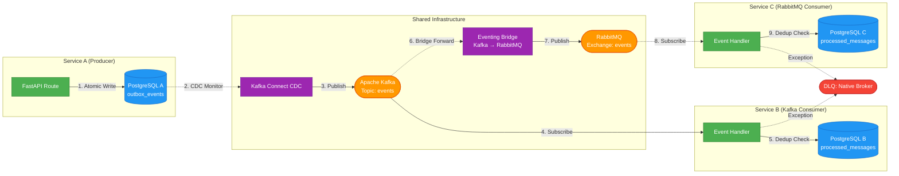

# Eventing

[Documentation Status](https://python-eventing.readthedocs.io/en/latest/?badge=latest)
[Tests](https://github.com/firstunicorn/python-eventing/actions)
[Python](https://www.python.org/downloads/)
[License](LICENSE)
[Code Style](https://github.com/astral-sh/ruff)
[Validate Dependencies](https://github.com/firstunicorn/python-eventing/actions/workflows/validate-dependencies.yml)

## Table of contents

- [Installation](#installation)
- [When to use this package](#when-to-use-this-package)
- [Comparison with alternatives](#comparison-with-alternatives)
- [Scope](#scope)
- [Quick start: transactional outbox](#quick-start-transactional-outbox)
- [Setup](#setup)
- [Advanced: EventBus](#advanced-eventbus-optional)
- [Documentation](#documentation)
- [Local development](#local-development)

Package-first universal event infrastructure for microservices.

📚 **[Full Documentation](https://python-eventing.readthedocs.io/en/latest/)** - Comprehensive guides and API reference

## Installation

```bash
pip install python-eventing
# or
poetry add python-eventing
```

**Import package name:** `messaging` (distribution is `python-eventing`)

```python
from messaging.core import BaseEvent
from messaging.infrastructure import SqlAlchemyOutboxRepository
```

**Requirements:**
- Python 3.12+
- PostgreSQL (outbox persistence)
- Kafka Connect with Debezium CDC (publishing infrastructure)

## When to use this package

**Use `python-eventing` if you need:**
- Guaranteed event delivery via transactional outbox pattern
- Kafka-based microservice messaging with CDC publishing
- Dead letter queue handling with database bookkeeping
- Idempotent consumer patterns with durable deduplication
- Native broker integration (FastStream, Debezium CDC, RabbitMQ DLX)

**Consider alternatives if:**
- Simple in-process events only → <a href="https://github.com/mdapena/pyventus" target="_blank">`pyventus`</a>
- FastAPI request-scoped events → <a href="https://github.com/melvinkcx/fastapi-events" target="_blank">`fastapi-events`</a>
- Non-Kafka message brokers without CDC support
- No need for durable outbox persistence

Support scale: `❌` none, `✅` basic, `✅✅` strong, `✅✅✅` first-class

## Comparison with alternatives

`python-eventing` prioritizes **durable messaging** (transactional outbox + CDC) and **Kafka/RabbitMQ integration** over in-process event simplicity:

| Capability | `python-eventing` | <a href="https://github.com/mdapena/pyventus" target="_blank">`pyventus`</a> | <a href="https://github.com/melvinkcx/fastapi-events" target="_blank">`fastapi-events`</a> | Notes |
| --- | --- | --- | --- | --- |
| Transactional outbox | ✅✅✅ | ❌ | ❌ | Durable local DB plus outbox boundary is a core feature here |
| Kafka data plane | ✅✅✅ | ❌ | ❌ | This package is built for Kafka-backed microservice messaging |
| DLQ handling | ✅✅✅ | ❌ | ❌ | Leverages native RabbitMQ DLX and Kafka Connect DLQ SMT with database bookkeeping |
| Health checks for eventing runtime | ✅✅✅ | ❌ | ❌ | Outbox health checks plus FastStream ASGI broker health endpoint |
| Typed cross-service event contracts | ✅✅ | ✅ | ✅✅ | `python-eventing` and `fastapi-events` are stronger on explicit payload modeling |
| Decorator subscriber registration | ✅✅ | ✅✅✅ | ✅✅ | `EventBus.subscriber(...)` exists now; `pyventus` is still the most polished here |
| In-process dispatch backend abstraction | ✅✅ | ✅✅✅ | ✅ | `DispatchBackend` exists here; `pyventus` offers a broader processor model |
| Lifecycle hooks / callbacks | ✅✅ | ✅✅✅ | ✅ | `DispatchHooks` covers dispatch, success, failure, disabled, and debug |
| Debug / disable controls | ✅✅ | ✅✅ | ✅✅✅ | `DispatchSettings(enabled, debug)` is implemented; `fastapi-events` is strongest for app-level toggling |
| Observability / telemetry polish | ✅✅ | ✅ | ✅✅✅ | FastStream native middlewares (KafkaTelemetryMiddleware, KafkaPrometheusMiddleware) integrated |
| Resilience middleware | ✅✅ | ❌ | ❌ | CircuitBreakerMiddleware (prevents cascading failures) and RateLimiterMiddleware (throttles consumption rate) |
| CDC-based outbox publishing | ✅✅✅ | ❌ | ❌ | Kafka Connect with Debezium CDC handles outbox-to-Kafka publishing |
| Consumer dedup helper | ✅✅✅ | ❌ | ❌ | `IdempotentConsumerBase` now uses a durable processed-message store instead of process memory |
| Durable cross-service idempotency | ✅✅✅ | ❌ | ❌ | `IProcessedMessageStore` plus `SqlAlchemyProcessedMessageStore` provide transactional duplicate protection |
| Consumer batch handling | ❌ | ❌ | ✅✅✅ | `fastapi-events` supports `handle_many(...)`; this package stays one-message-per-consume today |
| FastAPI-local event flow | ❌ | ✅ | ✅✅✅ | This package intentionally avoids request-lifecycle middleware eventing |

## Scope

**Included:**
- Transactional outbox primitives (write-side only; CDC handles publishing)
- Event contracts and registry
- Kafka/RabbitMQ consumer base classes with idempotency
- Native broker integration (Kafka Connect CDC, RabbitMQ DLX, FastStream middlewares)
- In-process emitter/subscriber facade and hooks
- DLQ bookkeeping consumer for database flag synchronization

**NOT included (delegated to external systems):**
- Event publishing (handled by Kafka Connect with Debezium CDC)
- Message broker infrastructure setup (use official Kafka/RabbitMQ documentation)
- Schema registry management (use Confluent Schema Registry or alternatives)
- Request-scoped FastAPI event middleware (intentionally avoided)
- Consumer batch handling (use `fastapi-events` if needed)

## Documentation

📖 **[Integration Guide](https://python-eventing.readthedocs.io/en/latest/integration-guide.html)** - Step-by-step integration instructions

🔍 **[API Reference](https://python-eventing.readthedocs.io/en/latest/autoapi/index.html)** - Complete API documentation

📋 **[Event Catalog](https://python-eventing.readthedocs.io/en/latest/event-catalog.html)** - Available event types and contracts

### Key topics

- [Transactional Outbox Pattern](https://python-eventing.readthedocs.io/en/latest/transactional-outbox.html) - Guaranteed event delivery (PRIMARY)
- [Cross-Service Communication](https://python-eventing.readthedocs.io/en/latest/cross-service-communication.html) - Database isolation, Kafka/RabbitMQ architecture, production deployment
- [Idempotent Consumers](https://python-eventing.readthedocs.io/en/latest/consumer-transactions.html) - Duplicate message handling
- [Health Checks](https://python-eventing.readthedocs.io/en/latest/autoapi/eventing/infrastructure/health/index.html) - Monitoring outbox and broker status

**Architecture note**: This package handles the **write side** of the outbox pattern (persisting events transactionally with business data). **Publishing** is delegated to Kafka Connect with Debezium CDC, which captures outbox table changes and publishes to Kafka. The **bridge component** (part of standard architecture) forwards events from Kafka to RabbitMQ for services preferring AMQP. Dead letter handling leverages native broker mechanisms (RabbitMQ DLX, Kafka Connect DLQ SMT) with a minimal bookkeeping consumer to maintain database failed-event flags.

## Architecture

### Quick Overview

**Cross-service communication pattern:** Each microservice has its own PostgreSQL database (database-per-service). Services communicate via **Kafka** (shared event backbone) and **RabbitMQ** (dual-broker pattern via bridge).



**Key points:**

- Each service has **separate PostgreSQL database** (DB1, DB2, DB3)
- **Kafka** is the shared event bus connecting all services
- **Kafka Connect CDC** watches Service A's outbox and publishes to Kafka
- **Service B** consumes directly from Kafka
- **Bridge** forwards Kafka → RabbitMQ for services preferring AMQP
- **Service C** consumes from RabbitMQ
- Both Kafka and RabbitMQ are part of the **standard architecture**

**Guarantees:**

- **Write Phase**: ✅ Atomic (business data + event in same transaction, same database)
- **Publish Phase**: ✅ At-least-once (CDC retries on failure)
- **Consume Phase**: ✅ Exactly-once (idempotency via processed message store in consumer's database)

📖 **[Cross-Service Communication Guide](https://python-eventing.readthedocs.io/en/latest/cross-service-communication.html)** - Detailed explanation with production deployment patterns

### Database isolation and event flow

**Critical architecture principle:** Each service maintains its **own PostgreSQL database** (database-per-service pattern). Services do NOT directly access each other's databases. **Kafka acts as the shared event bus** connecting isolated services.

**Complete event flow:**

1. **Service A (Producer)** writes event to its own `outbox_events` table (in postgres-a)
2. **Kafka Connect CDC** monitors Service A's outbox table via PostgreSQL WAL
3. **CDC publishes** event to **Kafka topic** (shared infrastructure)
4. **Service B (Consumer)** subscribes to **Kafka topic**, processes event, stores idempotency check in its own `processed_messages` table (in postgres-b)
5. **Bridge Service** forwards events from **Kafka → RabbitMQ** (part of standard architecture)
6. **Service C (Consumer)** subscribes to **RabbitMQ exchange**, processes event, stores idempotency check in its own `processed_messages` table (in postgres-c)

**Result:** Services remain isolated (no shared database), communicate via Kafka, and maintain exactly-once processing guarantees via their own idempotency stores.

### Full Component Architecture

```text
┌─────────────────────────────────────────────────────────────────────────────┐
│                         YOUR SERVICE (FastAPI)                               │
│                                                                              │
│  ┌──────────────┐      ┌──────────────────────────────────────────────┐    │
│  │   Routes     │──┬──▶│      python-eventing (SHARED CONTRACTS)       │    │
│  └──────────────┘  │   │                                               │    │
│                    │   │  • BaseEvent (Pydantic base)                  │    │
│                    │   │  • IOutboxRepository (Protocol)               │    │
│                    │   │  • IProcessedMessageStore (Protocol)          │    │
│                    │   └───────────────────┬───────────────────────────┘    │
│                    │                       │ Uses contracts                 │
│                    │                       ▼                                │
│                    │   ┌──────────────────────────────────────────────┐    │
│                    │   │         python-eventing (implementations)     │    │
│                    │   │                                               │    │
│                    │   │  ┌────────────────────────────────────────┐  │    │
│                    │   │  │  WRITE SIDE (Primary)                  │  │    │
│                    └───┼──│  • SqlAlchemyOutboxRepository          │  │    │
│                        │  │    (implements IOutboxRepository)      │  │    │
│                        │  │  • OutboxEventHandler                  │  │    │
│                        │  │                                        │  │    │
│                        │  │  OPTIONAL (In-process dispatch)        │  │    │
│                        │  │  • EventBus (NOT wired to outbox)      │  │    │
│                        │  └────────────────────────────────────────┘  │    │
│                        └──────────────────────────────────────────────┘    │
└────────────────────────────────────┬────────────────────────────────────────┘
                                     │ Writes to
                                     ▼
                          ┌─────────────────────┐
                          │   PostgreSQL DB     │
                          │                     │
                          │ ┌─────────────────┐ │
                          │ │ Business Tables │ │
                          │ └─────────────────┘ │
                          │ ┌─────────────────┐ │◀─┐
                          │ │ outbox_event_   │ │  │ Monitors
                          │ │ record          │ │  │ (WAL)
                          │ └────────┬────────┘ │  │
                          │ ┌────────▼────────┐ │  │
                          │ │ processed_      │ │  │
                          │ │ messages        │ │  │
                          │ └─────────────────┘ │  │
                          └─────────────────────┘  │
                                     │              │
                 ┌───────────────────┼──────────────┘
                 │                   │
                 │                   ▼
                 │    ┌──────────────────────────────────┐
                 │    │  EXTERNAL INFRASTRUCTURE         │
                 │    │  (Not provided by this package)  │
                 │    │                                  │
                 │    │  Kafka Connect + Debezium CDC    │
                 │    │  - PostgreSQL Connector          │
                 │    │  - Outbox Event Router SMT       │
                 │    └──────────────┬───────────────────┘
                 │                   │ Publishes
                 │                   ▼
                 │            ┌──────────────┐
                 │            │    Kafka     │
                 │            │   Topics     │
                 │            └──┬────────┬──┘
                 │               │        │
                 │               │        │
            Bookkeeping          │        │
            updates              │        │
                 │               │        │
                 │               ▼        ▼
                 │    ┌──────────────────────────────────────────────────────┐
                 │    │         FASTSTREAM BROKER LAYER                      │
                 │    │  (Broker abstraction + middleware)                   │
                 │    │                                                      │
                 │    │  ┌────────────────────────────────────────────────┐ │
                 │    │  │  KafkaBroker (from faststream.confluent)       │ │
                 │    │  │  • @broker.subscriber("topic") decorators      │ │
                 │    │  │  • broker.publish() wrapper                    │ │
                 │    │  │  • Pydantic auto-deserialization               │ │
                 │    │  │  • make_ping_asgi health endpoint              │ │
                 │    │  └────────────────────────────────────────────────┘ │
                 │    │                                                      │
                 │    │  ┌────────────────────────────────────────────────┐ │
                 │    │  │  MIDDLEWARE STACK (Wired)                      │ │
                 │    │  │  • CircuitBreakerMiddleware (resilience)       │ │
                 │    │  │  • RateLimiterMiddleware (optional, disabled)  │ │
                 │    │  │  • KafkaPrometheusMiddleware (metrics)         │ │
                 │    │  │  • KafkaTelemetryMiddleware (OTel)             │ │
                 │    │  └────────────────────────────────────────────────┘ │
                 │    └──────────────────────┬───────────────────────────────┘
                 │                           │
                 │                           │ Consumes
                 │                           ▼
                 │    ┌──────────────────────────────────────────────────────┐
                 │    │  DOWNSTREAM SERVICES                                 │
                 │    │                                                      │
                 │    │  ┌──────────────────────────────────────────────┐   │
                 │    │  │  READ SIDE (python-eventing)                 │   │
                 │    │  │                                              │   │
                 │    │  │  @broker.subscriber("user.created")          │   │
                 │    │  │  async def handle(event: UserCreated):       │   │
                 │    │  │      # FastStream deserializes to Pydantic   │   │
                 │    │  │      ...                                     │   │
                 │    │  │                                              │   │
                 │    │  │  OR use IdempotentConsumerBase for:          │   │
                 │    │  │  • Programmatic idempotency control          │   │
                 │    │  │  • Dynamic/polymorphic event types           │   │
                 │    │  │  • Legacy dict-based handling                │   │
                 │    │  │                                              │   │
                 │    │  │  Components:                                 │   │
                │    │  │  • EventRegistry (event type→class mapping)  │   │
                │    │  │  • SqlAlchemyProcessedMessageStore           │   │
                │    │  │    (implements IProcessedMessageStore)       │   │
                │    │  └──────────────────────────────────────────────┘   │
                │    │                                                      │
                │    │  ┌──────────────────────────────────────────────┐   │
                │    │  │  BRIDGE COMPONENT (Standard Architecture)    │   │
                │    │  │  • BridgeConsumer (Kafka→RabbitMQ bridge)    │   │
                │    │  │    (manual idempotency, not base class)      │   │
                │    │  │  • Part of dual-broker event distribution    │   │
                │    │  │                                              │   │
                │    │  │  RabbitMQ Broker Middleware Stack:           │   │
                │    │  │  • CircuitBreakerMiddleware (resilience)     │   │
                │    │  │  • RateLimiterMiddleware (optional)          │   │
                │    │  │  • RabbitPrometheusMiddleware (metrics)      │   │
                │    │  │  • TelemetryMiddleware (OTel, shared)        │   │
                 │    │  └──────────────────────────────────────────────┘   │
                 │    │                                  │                   │
                 │    │                                  │ On failure        │
                 │    │                                  ▼                   │
                 │    │                        ┌──────────────────┐          │
                 │    │                        │ EXTERNAL DLQ     │          │
                 │    │                        │ (broker native)  │          │
                 │    │                        │ • Kafka Connect  │          │
                 │    │                        │   DLQ SMT        │          │
                 │    │                        │ • RabbitMQ DLX   │          │
                 │    │                        └─────────┬────────┘          │
                 │    │                                  │                   │
                 │    │                                  ▼                   │
                 │    │                        ┌──────────────────┐          │
                 │    │                        │  DLQ Bookkeeper  │          │
                 │    │                        │  Consumer        │          │
                 │    │                        │  (@broker.sub)   │          │
                 │    │                        └──────────────────┘          │
                 │    │                                  │                   │
                 └────┼──────────────────────────────────┘                   │
                      │                                                      │
                      └──────────────────────────────────────────────────────┘
                                                 │
                                                 ▼
                                    ┌─────────────────────┐
                                    │  Admin/Ops API      │
                                    │  • DLQAdminService  │
                                    │  • Replay API       │
                                    │  • Health Checks    │
                                    └─────────────────────┘
```

## FastStream: The Broker Adapter

[FastStream](https://faststream.ag2.ai/) is the **Pythonic adapter** that wraps low-level Kafka/RabbitMQ clients (like `confluent-kafka`, `aio-pika`) and provides a decorator-based, async/await, type-safe API.

**Think of it like SQLAlchemy for message brokers** - it hides 200+ lines of boilerplate:

```python
# WITHOUT FastStream (raw Kafka client)
from confluent_kafka import Consumer
consumer = Consumer({'bootstrap.servers': 'localhost:9092', ...})
consumer.subscribe(['user.created'])
while True:
    msg = consumer.poll(1.0)
    if msg:
        event_dict = json.loads(msg.value().decode())
        event = UserCreatedEvent(**event_dict)  # Manual conversion
        await handle_user_created(event)
        consumer.commit(msg)

# WITH FastStream (what you actually write)
from faststream.confluent import KafkaBroker

broker = KafkaBroker("localhost:9092")

@broker.subscriber("user.created")
async def handle_user_created(event: UserCreatedEvent):  # ✅ Already a Pydantic model!
    # FastStream automatically:
    # - Polls Kafka, decodes bytes → JSON → Pydantic
    # - Runs middleware (telemetry, circuit breaker, rate limiter)
    # - Commits offset on success, sends to DLQ on failure
    print(f"User {event.user_id} created!")
```

**What FastStream provides:**

- 🎯 **Decorator-based subscriptions**: `@broker.subscriber("topic")`
- 🔄 **Automatic Pydantic conversion**: Type hints → auto-deserialization
- 🔌 **Middleware hooks**: Circuit breakers, rate limiting, telemetry, metrics
- 🏥 **Native health checks**: `make_ping_asgi` endpoint for broker status
- 🔀 **Unified API**: Same code works for Kafka, RabbitMQ, NATS, Redis Streams

`python-eventing` uses FastStream for all Kafka/RabbitMQ interactions, giving you a clean, Pythonic API while handling all the low-level complexity.

## Setup

### Database schema

The outbox table stores events transactionally with your business data:

```sql
CREATE TABLE outbox_events (
    event_id VARCHAR(36) PRIMARY KEY,
    event_type VARCHAR(255) NOT NULL,
    aggregate_id VARCHAR(255) NOT NULL,
    payload JSONB NOT NULL,
    occurred_at TIMESTAMPTZ NOT NULL,
    published BOOLEAN DEFAULT FALSE NOT NULL,
    failed BOOLEAN DEFAULT FALSE NOT NULL,
    attempt_count INTEGER DEFAULT 0 NOT NULL,
    created_at TIMESTAMPTZ NOT NULL,
    published_at TIMESTAMPTZ,
    failed_at TIMESTAMPTZ,
    error_message TEXT
);

CREATE INDEX idx_outbox_unpublished ON outbox_events (published, created_at);
```

### Application startup

Initialize the outbox repository and event bus at application startup:

```python
from fastapi import FastAPI
from sqlalchemy.ext.asyncio import create_async_engine
from messaging.infrastructure import SqlAlchemyOutboxRepository
from messaging.core import build_event_bus

app = FastAPI()

@app.on_event("startup")
async def startup():
    # Database engine
    engine = create_async_engine("postgresql+asyncpg://...")
    
    # Outbox repository
    outbox_repo = SqlAlchemyOutboxRepository(engine)
    app.state.outbox_repository = outbox_repo
    
    # Optional: EventBus for advanced patterns
    event_bus = build_event_bus()
    app.state.event_bus = event_bus
```

**CDC Publishing:** Kafka Connect with Debezium CDC automatically detects outbox table changes and publishes to Kafka. See [`debezium-cdc-architecture.md`](https://python-eventing.readthedocs.io/en/latest/debezium-cdc-architecture.html) for configuration.

## Quick Start: Transactional Outbox

The **core pattern** is the transactional outbox - persist events atomically with your business data:

```python
from fastapi import Depends
from messaging.core import BaseEvent
from messaging.infrastructure import SqlAlchemyOutboxRepository

# Define domain event
class UserCreated(BaseEvent):
    event_type: str = "user.created"
    aggregate_id: str
    user_id: int
    email: str

# Simple, direct approach (recommended)
@app.post("/users")
async def create_user(
    data: CreateUserRequest,
    session = Depends(get_session),
    outbox_repo: SqlAlchemyOutboxRepository = Depends(get_outbox_repo)
):
    # 1. Business logic
    user = User(**data.dict())
    session.add(user)

    # 2. Persist event to outbox (same transaction)
    await outbox_repo.add_event(
        UserCreated(
            aggregate_id=f"user-{user.id}",
            user_id=user.id,
            email=user.email,
        ),
        session=session
    )

    # 3. Commit both atomically
    await session.commit()

    # 4. Kafka Connect (Debezium CDC) detects the outbox insert and publishes to Kafka
    return {"user_id": user.id}
```

**Result**: Guaranteed delivery, no lost events, atomic writes.

---

## Advanced: EventBus (Optional)

For **decoupled architectures** with multiple side effects per event, use the **EventBus** abstraction layer:

```python
from messaging.core import BaseEvent
from messaging.infrastructure import OutboxEventHandler

# Access EventBus (initialized at startup)
event_bus = request.app.state.event_bus
outbox_repo = request.app.state.outbox_repository

# Register handler (typically at startup)
event_bus.register(UserCreated, OutboxEventHandler(outbox_repo))

# Dispatch (same result as direct add_event, but decoupled)
await event_bus.dispatch(UserCreated(...))
```

**When to use EventBus**:

- ✅ Multiple side effects per event (audit, metrics, cache)
- ✅ Need lifecycle hooks for observability
- ✅ Testing isolation (enable/disable toggle)
- ✅ Decorator-based handler registration

**When NOT needed**:

- ❌ Simple event persistence (use direct `outbox_repo.add_event()`)
- ❌ Single handler per event
- ❌ No need for hooks/tracing

📚 **[EventBus Documentation](./docs/eventbus/usage-guide.md)** - Complete guide for advanced patterns

## Distribution

- PyPI distribution name: `python-eventing`
- Python import package: `messaging`

```python
# Install
pip install python-eventing

# Import
from messaging.core import BaseEvent
from messaging.infrastructure import SqlAlchemyOutboxRepository
```

Services should consume the published package rather than source checkout. Kafka remains shared infrastructure with local producer/consumer clients per service.

## Local development

```powershell
poetry install
poetry build
poetry run pytest
```

### Testing

**Local (Windows):**
- Run non-RabbitMQ tests: `poetry run pytest tests/ -v -m "not requires_rabbitmq"`
- RabbitMQ integration tests fail due to Docker Desktop networking limitations

**CI/CD (Recommended for complete coverage):**
- GitHub Actions runs all 192 tests on Linux (100% pass rate)
- Workflows configured in `.github/workflows/`
- See `.github/workflows/README.md` for details

**For complete local test coverage on Windows:** See [Windows Testing with WSL2](docs/WINDOWS_TESTING_WITH_WSL2.md) (requires Docker Desktop WSL integration setup).

