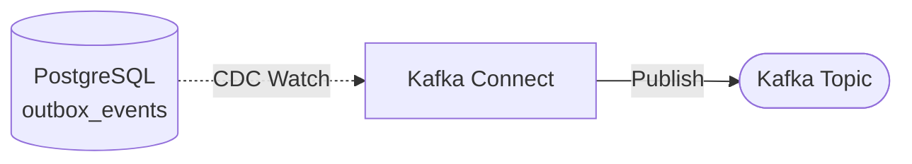
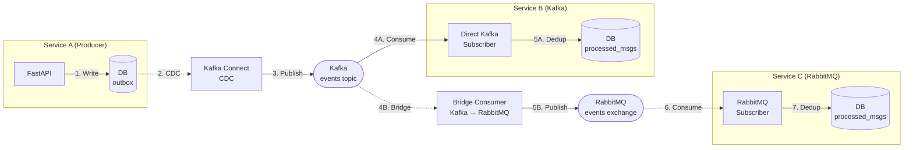

# Broker Features Comparison: Kafka vs RabbitMQ

> **🎯 Industry Best Practice (Uber/Zalando):**
>
> *"For the growing number of organizations whose needs span both categories, the pragmatic approach is to run both brokers, using Kafka for event streaming and RabbitMQ for task queuing and routing. This dual-broker pattern is employed by companies like Uber and Zalando."*
>
> **— Tech Insider 2026, Kafka vs RabbitMQ Industry Analysis**
>
> **What this means:**
> - **Kafka** (via outbox + CDC): Event streaming, analytics, audit logs
> - **RabbitMQ** (direct): Task queues, notifications, low-latency jobs
> - **NO BRIDGE NEEDED** - Services choose broker at publish time
> - **Rating:** 78/100 (vs 65/100 with bridge overhead)

**[Overview](#overview)** • **[Debezium Impact](#debezium-cdc-impact-on-architecture)** • **[Event Streaming vs Task Queuing](#event-streaming-vs-task-queuing)** • **[Kafka Features](#kafka-features)** • **[RabbitMQ Features](#rabbitmq-features)** • **[Feature Comparison](#coverage-feature-comparison)** • **[When to Use](#when-to-use-each-broker-industry-pattern-uberzalando)** • **[Real-World Example](#real-world-example-e-commerce-service)** • **[Bridge Pattern (⚠️ Optional)](#bridge-pattern-automatic-forwarding--optional---not-recommended-for-new-systems)**

## Overview

This service supports **dual-broker architecture** - the industry-standard pattern used by **Uber, Zalando**, and modern microservices.

### ✅ Recommended: Pattern 1 - Choose Broker at Publish Time

**Services make conscious architectural choice per use case:**

```python
# KAFKA (via outbox + CDC): Event streaming
await outbox_repo.add_event(OrderCreated(...), session=session)
# → Multiple consumers, replay capability, ACID guarantees

# RABBITMQ (direct): Task queues
await rabbit_publisher.publish(SendEmailTask(...), routing_key="email.high")
# → One worker, priority support, low latency, deleted after processing
```

**Characteristics:**
- **No bridge component** - Services choose directly at publish time
- **Right tool for each job** - Kafka for events, RabbitMQ for tasks
- **Used by:** Uber, Zalando, and modern microservice architectures
- **Rating:** 78/100

### Optional: Pattern 2 - Bridge Component

**Automatic Kafka → RabbitMQ forwarding:**
- **Use ONLY when:** Migration from RabbitMQ to Kafka, compliance requirements
- **Trade-offs:** Added complexity, latency, maintenance overhead
- **Rating:** 65/100

**⚠️ Most architectures don't need a bridge.** Use Pattern 1 (choose at publish time) for new systems.

---

## Debezium CDC: Impact on Architecture

This codebase uses **Debezium Change Data Capture (CDC)** for outbox publishing. Understanding how Debezium works is critical to making informed broker decisions.

### What is Debezium?

**Debezium** is a distributed platform for change data capture (CDC). It monitors your PostgreSQL database's **Write-Ahead Log (WAL)** and streams changes to Kafka in real-time.

**For the outbox pattern:**
- Application writes events to `outbox_event_record` table (transactional)
- Debezium detects the insert via PostgreSQL WAL
- EventRouter SMT transforms the outbox row into a proper Kafka message
- Event published to Kafka within milliseconds (<100ms)

### Outbox Publishing: With vs Without Debezium

#### ❌ Without Debezium (Polling Worker - Removed from Codebase)

```python
# Custom Python worker (NO LONGER USED)
class ScheduledOutboxWorker:
    async def run(self):
        while True:
            await asyncio.sleep(5)  # Poll every 5 seconds
            events = await self.query_unpublished_events()
            for event in events:
                await self.kafka_publisher.publish(event)
                await self.mark_published(event)
```

**Problems:**
- ❌ **5-30 seconds latency** (polling interval)
- ❌ **High database load** (continuous `SELECT ... FOR UPDATE` queries)
- ❌ **Complex concurrency code** (Python async, error handling, retries)
- ❌ **Single-threaded bottleneck** (polling loop limits throughput)

#### ✅ With Debezium CDC (Current Architecture)

```yaml
# Kafka Connect configuration (external infrastructure)
{
  "name": "outbox-connector",
  "config": {
    "connector.class": "io.debezium.connector.postgresql.PostgresConnector",
    "database.hostname": "postgres",
    "database.dbname": "your_db",
    "table.include.list": "public.outbox_event_record",
    "plugin.name": "pgoutput",  # PostgreSQL WAL reader
    
    # Debezium EventRouter SMT
    "transforms": "outbox",
    "transforms.outbox.type": "io.debezium.transforms.outbox.EventRouter",
    "transforms.outbox.table.field.event.id": "id",
    "transforms.outbox.table.field.event.key": "aggregate_id",
    "transforms.outbox.table.field.event.type": "event_type",
    "transforms.outbox.table.field.event.payload": "payload",
    "transforms.outbox.route.by.field": "event_type"
  }
}
```

**Advantages:**
- ✅ **Near-zero latency** (<100ms from commit to Kafka)
- ✅ **No database query load** (reads WAL only, not tables)
- ✅ **No custom code** (external infrastructure handles everything)
- ✅ **Horizontal scaling** (Kafka Connect cluster with multiple workers)
- ✅ **Automatic retries** (Kafka Connect handles failures)

### How Debezium Works: WAL-Based CDC

```text
Application Transaction:
┌─────────────────────────┐
│ BEGIN                   │
│ INSERT INTO users ...   │ ← Business data
│ INSERT INTO outbox ...  │ ← Event data
│ COMMIT                  │ ← Atomic!
└─────────────────────────┘
          ↓
PostgreSQL WAL (Write-Ahead Log):
┌─────────────────────────┐
│ LSN 1234: START TX      │
│ LSN 1235: users row     │
│ LSN 1236: outbox row    │ ← Debezium reads THIS
│ LSN 1237: COMMIT        │
└─────────────────────────┘
          ↓
Debezium EventRouter:
┌─────────────────────────┐
│ Parse outbox row        │
│ Extract: event_type →   │
│   Topic name            │
│ Extract: aggregate_id → │
│   Kafka key             │
│ Extract: payload →      │
│   Kafka value           │
│ Publish to Kafka        │
└─────────────────────────┘
          ↓
Kafka Topic:
┌─────────────────────────┐
│ Topic: user.created     │
│ Key: user-123           │
│ Value: {"userId": 123,  │
│         "email": "..."}│
└─────────────────────────┘
```

**Why WAL is powerful:**
- PostgreSQL writes ALL changes to WAL before tables (durability guarantee)
- Debezium tails WAL using logical replication (`pgoutput` plugin)
- Events published **immediately after COMMIT** (no polling delay)
- Zero impact on application queries (WAL is separate from table reads)

### Debezium EventRouter SMT

**SMT (Single Message Transform)** is Debezium's transformation engine. The **EventRouter** is specifically designed for the outbox pattern:

```json
// Outbox table row:
{
  "id": "550e8400-e29b-41d4-a716-446655440000",
  "aggregate_id": "user-123",
  "event_type": "user.created",
  "payload": "{\"userId\": 123, \"email\": \"user@example.com\", \"name\": \"John Doe\"}"
}

// EventRouter transforms to Kafka message:
Topic: user.created              ← From event_type field
Key: user-123                    ← From aggregate_id field
Value: {                         ← Unwrapped payload
  "userId": 123,
  "email": "user@example.com",
  "name": "John Doe"
}
Headers:
  id: 550e8400-e29b-41d4-a716-446655440000
```

**Configuration mapping:**
```json
"transforms.outbox.table.field.event.id": "id",              // → Kafka header
"transforms.outbox.table.field.event.key": "aggregate_id",   // → Kafka key (partition routing)
"transforms.outbox.table.field.event.type": "event_type",    // → Kafka topic name
"transforms.outbox.table.field.event.payload": "payload",    // → Kafka value (unwrapped)
"transforms.outbox.route.by.field": "event_type"             // Route to topic by this field
```

### External Infrastructure Required

**⚠️ This package does NOT provide:**
1. **Kafka Connect cluster** (separate JVM-based service)
2. **Debezium PostgreSQL connector plugin**
3. **Connector configuration and deployment**

**You must deploy:**
```yaml
# docker-compose.yml (simplified)
services:
  postgres:
    environment:
      - POSTGRES_DB=your_db
      - POSTGRES_USER=postgres
      # Enable WAL for CDC
      - POSTGRES_INITDB_ARGS=-c wal_level=logical
  
  kafka:
    # Kafka cluster
  
  kafka-connect:
    image: debezium/connect:2.6
    environment:
      - BOOTSTRAP_SERVERS=kafka:9092
      - GROUP_ID=kafka-connect
    depends_on:
      - kafka
      - postgres
```

**Then register connector via REST API:**
```bash
curl -X POST http://kafka-connect:8083/connectors \
  -H "Content-Type: application/json" \
  -d @outbox-connector-config.json
```

### Performance Impact

| Metric | Polling Worker | Debezium CDC |
|--------|---------------|--------------|
| **Latency** | 5-30 seconds | <100ms |
| **Database CPU** | High (continuous queries) | Minimal (WAL read) |
| **Throughput** | 500-1,000 events/sec | 100,000+ events/sec |
| **Scalability** | Single worker bottleneck | Horizontal (Kafka Connect cluster) |
| **Code complexity** | High (Python concurrency) | Zero (external service) |

---

## Event Streaming vs Task Queuing

**Critical distinction:** Debezium + Kafka solves **event streaming**, but RabbitMQ excels at **task queuing**. These are fundamentally different architectural patterns.

### Event Streaming Pattern (Kafka + Debezium)

**Semantic:** "Something happened in the past" (immutable fact)

```python
# KAFKA: Event for analytics, audit, inventory
await outbox_repo.add_event(
    OrderCreated(
        aggregate_id=f"order-{order.id}",
        order_id=order.id,
        user_id=user.id,
        items=order.items,
        total=100.00,
        timestamp=datetime.now(UTC)
    ),
    session=session
)

# ↓ Debezium CDC → Kafka topic "order.created"
# ↓
# MULTIPLE consumers react (fan-out):
# 1. Analytics service → Stores for business intelligence reports
# 2. Inventory service → Reserves stock for ordered items
# 3. Billing service → Creates invoice and payment record
# 4. Fraud detection → Checks order patterns
# 5. Audit service → Compliance log (immutable trail)
#
# ALL get the SAME event
# Event preserved forever (or retention period)
# Can REPLAY from hours/days ago for new consumers
```

**Characteristics:**
- ✅ **Multiple consumers** - Many services react to same event (fan-out)
- ✅ **Event history preserved** - Events stored for days/weeks (configurable retention)
- ✅ **Replay capability** - New service can process historical events
- ✅ **Immutable facts** - Events never change ("OrderCreated" is permanent)
- ✅ **Ordering guarantees** - Same partition key → FIFO order
- ⚠️ **Infrastructure complexity** - Requires outbox table + Debezium CDC
- ⚠️ **Higher latency** - 5-100ms (due to CDC, still acceptable)

**When to use:**
- Domain events (OrderCreated, UserRegistered, PaymentProcessed)
- Audit trails and compliance logs
- Analytics and business intelligence
- Event sourcing architectures
- Multiple downstream services need same data

### Task Queuing Pattern (RabbitMQ Direct)

**Semantic:** "Work to be done NOW" (command/task)

```python
# RABBITMQ: Task for email notification
await rabbit_publisher.publish_to_exchange(
    {
        "task_type": "send_email",
        "user_id": 123,
        "template": "order_confirmation",
        "recipient": "user@example.com",
        "order_id": order.id,
        "total": 100.00
    },
    routing_key="email.priority.high"  # Route to priority worker
)

# ↓ RabbitMQ directly (no outbox, no CDC)
# ↓
# ONE worker processes (competing consumers):
# - Email worker picks up task
# - Sends email via SMTP
# - Acknowledges message
# - Message DELETED from queue
#
# No replay (why would you resend old emails?)
# Priority support (urgent emails first)
# Sub-millisecond latency
```

**Characteristics:**
- ✅ **One consumer processes** - Single worker handles task (competing consumers)
- ✅ **Message deleted after processing** - No storage overhead
- ✅ **No replay needed** - Tasks are point-in-time actions
- ✅ **Priority support** - Process urgent tasks first (0-255 levels)
- ✅ **Sub-millisecond latency** - Direct publish, no CDC overhead
- ✅ **Simpler infrastructure** - No outbox table, no CDC required
- ✅ **Broker-side routing** - Complex patterns without producer changes

**When to use:**
- Email/SMS sending
- Image processing and resizing
- Webhook delivery
- Background job processing
- Real-time notifications
- File uploads and conversions

### Side-by-Side Comparison

| Aspect | Event Streaming (Kafka) | Task Queuing (RabbitMQ) |
|--------|------------------------|-------------------------|
| **Purpose** | Broadcast facts about what happened | Distribute work to be done |
| **Consumers** | Multiple (fan-out) | One (competing) |
| **Persistence** | Days/weeks (retention) | Until consumed (ephemeral) |
| **Replay** | Yes (time-travel) | No (not needed) |
| **Example** | "Order was created at 10:30 AM" | "Send email to user@example.com" |
| **Latency** | 5-100ms (CDC) | <1ms (direct) |
| **Infrastructure** | Outbox + Debezium + Kafka | RabbitMQ only |
| **Priority** | No (FIFO per partition) | Yes (0-255 levels) |
| **Routing** | Consumer-side (regex patterns) | Broker-side (exchange + routing keys) |

---

## Kafka Features

### 1. Consumer-side topic pattern subscription
**Consumer-side wildcard support** (not producer-side like RabbitMQ exchanges)

```python
# Kafka consumer supports regex patterns
from faststream.confluent import KafkaBroker

broker = KafkaBroker("localhost:9092")

# Subscribe to multiple topics via regex pattern
@broker.subscriber(pattern="^customer\\..*\\.validations$")
async def handle_validations(event: dict):
    # Matches: customer.us.validations, customer.eu.validations, etc.
    pass
```

**Use case:** Single consumer subscribes to dynamically created topics matching pattern
**Limitation:** Pattern matching happens at consumer subscription time, not broker routing time
**RabbitMQ advantage:** Broker-side routing (exchange + routing keys) vs Kafka's consumer-side patterns

**Kafka alternatives for content-based routing:**
- **Kafka Connect RegexRouter SMT:** Route records to topics via regex patterns
- **Kafka Streams:** Content-based routing with `KStream.branch()` or custom Processor API
- **ksqlDB:** SQL-based routing with `WHERE` clauses and regex extraction

**References:**
- Consumer patterns: https://stackoverflow.com/questions/39520222
- Kafka Connect SMT: https://docs.confluent.io/current/connect/transforms/regexrouter.html
- Kafka Streams routing: https://www.confluent.io/blog/streaming-etl-with-confluent-kafka-message-routing-and-fan-out/

### 2. Partition-based ordering
**Code:** `src/messaging/infrastructure/pubsub/kafka_publisher.py`

```python
# Kafka publisher uses partition key for ordering guarantees
key_bytes = key.encode("utf-8") if isinstance(key, str) else key
await self._broker.publish(
    message,
    topic=topic,
    key=key_bytes,  # Messages with same key go to same partition
)
```

**Use case:** Events for same aggregate (e.g., `user-123`) must be processed in order
**Guarantee:** Same partition key → same partition → FIFO order within partition

### 3. Consumer groups with offset tracking
**Code:** `src/messaging/config/kafka_settings.py`

```python
kafka_consumer_conf: dict[str, str] = Field(
    default_factory=lambda: {
        "group.id": "eventing-consumers",
        "partition.assignment.strategy": "cooperative-sticky",
        "max.poll.interval.ms": "600000",
        "session.timeout.ms": "45000",
        "heartbeat.interval.ms": "15000",
    }
)
```

**Use case:** Multiple consumer instances for horizontal scaling
**Guarantee:** Each partition assigned to only one consumer in group (at-least-once delivery)

### 4. Durable log retention
**Use case:** Replay events from past (time travel)
**Kafka feature:** Messages persisted for retention period (default 7 days)
**Not available in RabbitMQ:** Messages deleted once consumed/acked

### 5. CDC-based outbox publishing
**Code:** Architecture uses Kafka Connect with Debezium CDC



**Use case:** Guaranteed event publishing from database (transactional outbox pattern)
**Kafka-specific:** CDC tools designed for Kafka topics

### 6. Autoflush control
**Code:** `src/messaging/infrastructure/pubsub/kafka_publisher.py`

```python
class KafkaEventPublisher(IEventPublisher):
    def __init__(self, broker: KafkaBroker, autoflush: bool = False):
        self._autoflush = autoflush
    
    async def publish_to_topic(self, topic: str, message: dict[str, Any]):
        if self._autoflush:
            publisher = self._broker.publisher(topic, autoflush=True)
            await publisher.publish(message, key=key_bytes)
        else:
            # Buffered for batching (better performance)
            await self._broker.publish(message, topic=topic, key=key_bytes)
```

**Use case:** Trade-off between latency (autoflush=True) and throughput (autoflush=False)

---

## RabbitMQ Features

### 1. Topic-based routing with wildcards
**Code:** `src/messaging/infrastructure/pubsub/bridge/routing_key_builder.py`

```python
def build_routing_key(template: str, event: dict[str, str]) -> str:
    """Build routing key like 'user.created' or 'order.placed'"""
    safe_event = {k.replace(".", "_"): v for k, v in event.items()}
    return template.format(**safe_event)
```

**Use case:** Subscribe to patterns like `user.*` or `order.#` (wildcard routing)
**Pattern:**
- `*` matches one word: `user.*` → `user.created`, `user.updated`
- `#` matches zero or more: `order.#` → `order.placed`, `order.placed.confirmed`

### 2. Exchange types (topic, fanout, direct, headers)
**Code:** `src/messaging/infrastructure/pubsub/rabbit/publisher.py`

```python
# Explicit TOPIC exchange (supports wildcard routing)
if isinstance(default_exchange, str):
    self._default_exchange = RabbitExchange(
        default_exchange, 
        type=ExchangeType.TOPIC,  # Supports routing patterns
        durable=True
    )
```

**Exchange types:**
- **TOPIC**: Wildcard routing (`user.*`, `#`)
- **FANOUT**: Broadcast to all bound queues
- **DIRECT**: Exact routing key match
- **HEADERS**: Route by message headers

**Use case:** Flexible routing without changing producer code

### 3. Publisher confirms
**Code:** `src/messaging/config/rabbitmq_settings.py`

```python
rabbitmq_publisher_confirms: bool = Field(
    default=True,
    description="Enable RabbitMQ publisher confirms for reliability",
)
```

**Use case:** Synchronous acknowledgment that message reached broker/queue
**Trade-off:** Higher latency but guaranteed delivery before returning
**RabbitMQ advantage:** Publisher confirms are a core AMQP feature with flexible options (transactional, async confirms)
**Kafka equivalent:** Producer `acks=all` with idempotence (`enable.idempotence=true`)
**Reference:** https://www.rabbitmq.com/docs/confirms

### 4. Dead letter exchanges (DLX)
**Code:** Comments in `src/messaging/infrastructure/pubsub/dlq_bookkeeper/__init__.py`

```python
# @broker.subscriber("rabbitmq-dlq-queue")  # RabbitMQ DLQ queue
# async def handle_rabbitmq_dlq(msg, headers):
#     await update_db_flag_for_dlq_event(msg, headers, session_factory)
```

**Use case:** Failed messages automatically routed to DLX for retry/inspection
**RabbitMQ advantage:** Native exchange-based routing (built into broker)
**Kafka equivalent:** Kafka Connect DLQ SMT, consumer error handling, Kafka Streams DLQ patterns
**Reference:** https://www.confluent.io/learn/kafka-dead-letter-queue/

### 5. Rate limiting per consumer
**Code:** `src/messaging/config/rabbitmq_settings.py`

```python
rabbitmq_rate_limit: int = Field(default=500, description="Max messages per interval")
rabbitmq_rate_interval: float = Field(default=60.0, description="Rate window seconds")
rabbitmq_rate_limiter_enabled: bool = Field(default=False)
```

**Use case:** Protect downstream service from overload (500 msgs/minute)

---

## Bridge Pattern: Automatic Forwarding (⚠️ OPTIONAL - Not Recommended for New Systems)

**⚠️ Most architectures don't need a bridge.** Modern practice (Uber, Zalando) is **Pattern 1: Choose broker at publish time** based on use case (see [When to Use](#when-to-use-each-broker-industry-pattern)).

**Use bridge ONLY if:**
- Migrating from RabbitMQ to Kafka gradually
- Compliance requires events in both systems
- Strong organizational requirement for automatic forwarding

**Otherwise:** Services should directly choose Kafka (via outbox) for event streaming or RabbitMQ (direct) for task queues.

---

### Architecture
**Code:** `src/messaging/infrastructure/pubsub/bridge/consumer.py`

```python
class BridgeConsumer:
    """Consume events from Kafka and route to RabbitMQ with idempotency."""
    
    async def handle_message(self, message: dict[str, Any]):
        event_id = message.get("event_id") or message.get("eventId")
        
        # Check idempotency
        is_new = await self._processed_store.claim(
            consumer_name="kafka_rabbitmq_bridge", 
            event_id=event_id
        )
        if not is_new:
            return  # Already processed
        
        # Forward to RabbitMQ with routing key
        routing_key = build_routing_key(self._routing_template, message)
        await self._rabbit_publisher.publish_to_exchange(message, routing_key)
```

### How it works



**Key points:**
1. **Producer writes once** to outbox (Service A database)
2. **CDC publishes to Kafka** (primary event bus)
3. **Service B** consumes directly from Kafka (gets partition ordering, offset management)
4. **Bridge** forwards to RabbitMQ automatically (adds routing keys)
5. **Service C** consumes from RabbitMQ (gets topic routing, exchange patterns)

### Coverage: Feature Comparison

**Updated matrix with Debezium CDC:**

| Feature | Kafka (No CDC) | Kafka + Debezium CDC | RabbitMQ Direct |
|---------|----------------|----------------------|-----------------|
| **Outbox publishing** | ⚠️ Polling worker required | ✅✅✅ Real-time WAL streaming | N/A (no native outbox) |
| **Publish latency** | 5-30 seconds | <100ms | <1ms (sub-millisecond) |
| **Database load** | High (continuous queries) | Minimal (reads WAL only) | None (no outbox) |
| **ACID guarantees** | ✅ Atomic write | ✅ Atomic write | ❌ Dual-write problem |
| **Event replay** | ✅ Time-travel | ✅ Time-travel | ❌ Consumed = deleted |
| **Multiple consumers** | ✅ Fan-out | ✅ Fan-out | ⚠️ Via exchange (no replay) |
| **Priority queues** | ❌ FIFO only | ❌ FIFO only | ✅ 0-255 levels |
| **Task distribution** | ⚠️ Possible but awkward | ⚠️ Possible but awkward | ✅ Native pattern |
| **Broker-side routing** | ❌ Consumer-side regex | ❌ Consumer-side regex | ✅ Exchange + routing keys |
| **Event sourcing** | ✅ Immutable log | ✅ Immutable log | ❌ Not designed for this |
| **Operational complexity** | Low (no CDC) | High (Kafka Connect + Debezium) | Low (single service) |
| **Throughput** | 100K+ msg/sec | 100K+ msg/sec | 50-100K msg/sec |
| **Infrastructure deps** | Kafka cluster | Kafka + PostgreSQL + Kafka Connect | RabbitMQ cluster |
| **Use case** | Event streaming (no outbox) | Event streaming (with ACID) | Task queuing, notifications |

**Key insights:**
- **Debezium makes Kafka outbox practical** (vs polling worker)
- **RabbitMQ remains superior for task queues** (priority, low latency, simplicity)
- **Both complement each other** - use Kafka for events, RabbitMQ for tasks

**Original table (basic comparison):**

| Feature | Direct Kafka | Direct RabbitMQ | Notes |
|---------|-------------|-----------------|-------|
| **Ordering guarantees** | ✅ Partition-level FIFO | ⚠️ Queue-level (single consumer) | Kafka: per-partition, RabbitMQ: per-queue |
| **Consumer scaling** | ✅ Consumer groups | ⚠️ Competing consumers | Kafka: partition-based, RabbitMQ: queue-based |
| **Event replay** | ✅ Time-travel via offsets | ❌ Consumed = deleted | Kafka's key advantage for analytics |
| **Broker-side routing** | ❌ (consumer-side regex) | ✅ Exchange + routing keys | RabbitMQ: `user.*`, Kafka: subscribe patterns |
| **Content-based routing** | ✅ Via Kafka Streams/Connect SMT | ✅ Via exchanges/headers | Both support, different mechanisms |
| **Delivery confirmation** | ✅ Producer `acks=all` | ✅ Publisher confirms | Both have reliable delivery |
| **Dead letter queues** | ✅ Via Connect SMT/consumer logic | ✅ Native DLX | Both support DLQ, different implementations |
| **Message priorities** | ❌ Not supported | ✅ Priority queues | RabbitMQ-only feature |
| **Idempotency** | ✅ Producer idempotence | ⚠️ Application-level | Kafka: built-in, RabbitMQ: manual dedup |

**Key differences:**
- **Kafka strength:** Durable log, replay, high throughput, horizontal scaling
- **RabbitMQ strength:** Flexible routing, low latency, priority queues, mature AMQP ecosystem

---

## When to Use Each Broker (Industry Pattern: Uber/Zalando)

> **Industry Validation:**
>
> *"For the growing number of organizations whose needs span both categories, the pragmatic approach is to run both brokers, using Kafka for event streaming and RabbitMQ for task queuing and routing. This dual-broker pattern is employed by companies like Uber and Zalando."*
>
> **Source:** Tech Insider 2026 - Kafka vs RabbitMQ: 1M msgs/sec vs 40K

### Pattern Comparison: Bridge vs No Bridge

```text
❌ BRIDGE PATTERN (NOT RECOMMENDED FOR NEW SYSTEMS)
┌─────────────┐         ┌─────────────┐         ┌──────────────┐
│  Service A  │────────▶│    Kafka    │────────▶│    Bridge    │
│ (publishes) │         │             │         │   Service    │
└─────────────┘         └─────────────┘         └──────┬───────┘
                                                       │
                                                       ▼
                                                ┌──────────────┐
                                                │   RabbitMQ   │
                                                └──────────────┘
Rating: 65/100  |  Added complexity, latency, maintenance overhead

✅ UBER/ZALANDO PATTERN (RECOMMENDED)
┌─────────────────────────────────────────────────────────────┐
│ Service A: Event streaming needs                            │
│ await outbox_repo.add_event(OrderCreated(...))              │
│         ↓                                                    │
│     Kafka (via CDC)                                          │
│         ↓                                                    │
│ Multiple consumers (analytics, audit, inventory)            │
└─────────────────────────────────────────────────────────────┘

┌─────────────────────────────────────────────────────────────┐
│ Service B: Task queue needs                                 │
│ await rabbit_publisher.publish(SendEmailTask(...))          │
│         ↓                                                    │
│     RabbitMQ (direct)                                        │
│         ↓                                                    │
│ One worker (email sender, low latency, priority)            │
└─────────────────────────────────────────────────────────────┘
Rating: 78/100  |  Right tool for each job, no bridge overhead
```

---

### Choose Kafka (via outbox + CDC) for:
1. **Event sourcing** - Need complete event history replay
2. **Analytics** - Stream to data warehouse, long-term retention (7+ days)
3. **High throughput** - Millions of events/second
4. **Audit logs** - Immutable, durable log requirements
5. **Multiple consumers** - Many services need same events (high fan-out)

**Example services:**
- Order processing (sequential event stream)
- Financial transactions (audit trail)
- Analytics/data warehouse ingestion (replay for backfill)

```python
# Publish via outbox (goes to Kafka via CDC)
await outbox_repo.add_event(
    OrderCreated(aggregate_id=f"order-{order.id}", ...),
    session=session
)
```

### Choose RabbitMQ (direct publish) for:
1. **Task queues** - Background jobs, work distribution
2. **Notifications** - Email, SMS, push (low latency required)
3. **Complex routing** - Wildcard patterns (`user.*`, `order.#`)
4. **Priority queues** - Urgent tasks processed first
5. **Request-reply** - RPC-style communication over async

**Example services:**
- Email/SMS sender (low-latency task queue)
- Webhooks (fanout exchange to subscribers)
- Image processing workers (priority-based)

```python
# Publish directly to RabbitMQ (no outbox)
await rabbit_publisher.publish_to_exchange(
    {"task": "send_email", "user_id": 123},
    routing_key="email.priority.high"
)
```

### ⚠️ Bridge Pattern NOT Recommended for New Systems

**The bridge pattern (automatic Kafka → RabbitMQ forwarding) is NOT how Uber/Zalando use dual brokers.**

**Industry pattern:** Services choose broker at publish time (Pattern 1 above)
**Bridge use cases (rare):** Migration from RabbitMQ to Kafka, specific compliance requirements

**Why avoid bridge:**
- ❌ Added complexity (bridge service to maintain)
- ❌ Higher latency (extra hop: Kafka → Bridge → RabbitMQ)
- ❌ More infrastructure (bridge resources, monitoring)
- ✅ Pattern 1 is simpler - choose directly at publish time

---

## Real-World Example: E-Commerce Service

This example demonstrates **when to use each broker** in the same service:

```python
from fastapi import Depends
from sqlalchemy.ext.asyncio import AsyncSession
from messagekit.infrastructure import SqlAlchemyOutboxRepository, RabbitEventPublisher

class OrderService:
    """Order service using BOTH brokers for different purposes."""
    
    def __init__(
        self,
        session: AsyncSession,
        outbox_repo: SqlAlchemyOutboxRepository,  # Kafka via Debezium CDC
        rabbit_publisher: RabbitEventPublisher    # RabbitMQ direct
    ):
        self.session = session
        self.outbox_repo = outbox_repo
        self.rabbit_publisher = rabbit_publisher
    
    async def create_order(self, data: CreateOrderRequest):
        """Create order with dual publishing strategy."""
        
        # 1. Business logic (transactional)
        order = Order(
            user_id=data.user_id,
            items=data.items,
            total=calculate_total(data.items)
        )
        self.session.add(order)
        
        # 2. KAFKA: Publish domain event via outbox (for event streaming)
        #    → Multiple consumers: analytics, inventory, billing, fraud, audit
        #    → Needs replay capability (new services can backfill)
        #    → ACID guarantees (atomic with order creation)
        await self.outbox_repo.add_event(
            OrderCreated(
                aggregate_id=f"order-{order.id}",
                order_id=order.id,
                user_id=order.user_id,
                items=[item.dict() for item in order.items],
                total=order.total,
                timestamp=datetime.now(UTC)
            ),
            session=self.session
        )
        
        # 3. Commit atomically (order + event in same transaction)
        await self.session.commit()
        
        # 4. RABBITMQ: Publish task for email notification (direct)
        #    → ONE worker sends email
        #    → Low latency required (<5ms)
        #    → Priority support (urgent orders first)
        #    → No replay needed (don't resend old emails)
        #    → No ACID requirement (email can be sent separately)
        await self.rabbit_publisher.publish_to_exchange(
            {
                "task_type": "send_order_confirmation",
                "order_id": order.id,
                "user_email": data.email,
                "items_count": len(order.items),
                "total": float(order.total)
            },
            routing_key="email.transactional"  # Routes to email worker
        )
        
        return {"order_id": order.id, "status": "created"}
```

**What happens next:**

```text
KAFKA PATH (Event Streaming):
┌─────────────────────────────────────────────────────────────────┐
│ 1. Order + Event written to PostgreSQL (ATOMIC)                 │
│    ├── orders table: [order data]                               │
│    └── outbox_event_record: [OrderCreated event]                │
└──────────────────────────┬──────────────────────────────────────┘
                           ↓
┌──────────────────────────────────────────────────────────────────┐
│ 2. Debezium CDC watches PostgreSQL WAL                          │
│    - Detects outbox insert within <100ms                        │
│    - EventRouter transforms row → Kafka message                 │
│    - Publishes to Kafka topic "order.created"                   │
└──────────────────────────┬──────────────────────────────────────┘
                           ↓
┌──────────────────────────────────────────────────────────────────┐
│ 3. Multiple Kafka consumers process event:                      │
│    ✅ Analytics service → Stores for BI reports                 │
│    ✅ Inventory service → Reserves stock                        │
│    ✅ Billing service → Creates invoice                         │
│    ✅ Fraud detection → Analyzes patterns                       │
│    ✅ Audit service → Immutable compliance log                  │
│                                                                  │
│    ALL consumers can replay this event days/weeks later         │
└──────────────────────────────────────────────────────────────────┘

RABBITMQ PATH (Task Queuing):
┌──────────────────────────────────────────────────────────────────┐
│ 4. Task published directly to RabbitMQ (NO outbox, NO CDC)      │
│    - Exchange: "tasks"                                           │
│    - Routing key: "email.transactional"                          │
│    - Latency: <1ms                                               │
└──────────────────────────┬──────────────────────────────────────┘
                           ↓
┌──────────────────────────────────────────────────────────────────┐
│ 5. ONE email worker processes task:                             │
│    ✅ Picks up task from queue                                  │
│    ✅ Sends email via SMTP                                      │
│    ✅ Acknowledges message                                      │
│    ✅ Message DELETED (no replay needed)                        │
│                                                                  │
│    If email fails → DLX → retry queue → eventual success        │
└──────────────────────────────────────────────────────────────────┘
```

**Why use both?**

| Concern | Kafka (Event) | RabbitMQ (Task) |
|---------|---------------|-----------------|
| **Need replay?** | YES (analytics backfill) | NO (don't resend emails) |
| **Multiple consumers?** | YES (5+ services) | NO (one email worker) |
| **ACID required?** | YES (order + event atomic) | NO (email can be separate) |
| **Priority needed?** | NO | YES (urgent orders first) |
| **Latency requirement** | 100ms OK | <5ms critical |

**Result:** Use the right tool for each job - Kafka for events, RabbitMQ for tasks.

---

## Why RabbitMQ Still Has Value (Even with Debezium)

### Debezium Solves Event Streaming, Not Task Queuing

**Common misconception:** "With Debezium, Kafka does everything - why RabbitMQ?"

**Reality:** Debezium makes Kafka **dominant for event streaming**, but RabbitMQ remains **excellent for task queuing**:

### 1. **Priority Queues** ⭐⭐⭐

**Kafka:** NO priority support (FIFO per partition)
```python
# Kafka processes in order: message 1, 2, 3, 4...
# Can't skip ahead to urgent messages
```

**RabbitMQ:** Priority levels 0-255
```python
# Urgent task (priority=10)
await rabbit_publisher.publish(
    urgent_payment_task,
    routing_key="payment.processing",
    priority=10
)

# Normal task (priority=5)
await rabbit_publisher.publish(
    normal_task,
    routing_key="payment.processing",
    priority=5
)

# ✅ Worker processes priority=10 FIRST, then priority=5
```

**Use case:** Support ticket triage, payment processing (urgent transactions first), SLA-based task ordering

### 2. **Lower Latency for Task Queues** ⭐⭐

**Debezium + Kafka:**
```text
Application → PostgreSQL → WAL → Debezium → Kafka → Consumer
Latency: 5-100ms (typically 50ms)
```

**RabbitMQ Direct:**
```text
Application → RabbitMQ → Worker
Latency: <1ms (sub-millisecond)
```

**Use case:** Real-time notifications, live chat, webhook delivery, time-sensitive tasks

**When it matters:**
- Push notifications (user expects instant delivery)
- Live chat messages (sub-second latency required)
- Trading systems (milliseconds matter)

### 3. **Simpler Operations for Task Queues** ⭐⭐

**Kafka + Debezium infrastructure:**
```yaml
services:
  postgres:
    # PostgreSQL with WAL configuration
    environment:
      - POSTGRES_INITDB_ARGS=-c wal_level=logical
  
  kafka:
    # Kafka cluster (ZooKeeper or KRaft mode)
  
  kafka-connect:
    # Separate JVM service
    image: debezium/connect:2.6
  
  schema-registry:
    # Optional but recommended for Avro schemas

# Plus: Connector registration, monitoring, upgrades
```

**RabbitMQ for tasks:**
```yaml
services:
  rabbitmq:
    image: rabbitmq:3-management
    # Single service, done
```

**Benefit:** For task queues, you don't need the CDC complexity

### 4. **Broker-Side Routing** ⭐

**RabbitMQ:** Producer doesn't know about queues
```python
# Producer publishes with routing key
await publisher.publish(
    message,
    routing_key="user.new.email"  # Producer sets this
)

# Admin configures routing (no producer code change):
exchange.bind_queue("email-queue", routing_key="user.*.email")
exchange.bind_queue("sms-queue", routing_key="user.*.sms")
exchange.bind_queue("push-queue", routing_key="user.*.push")

# ✅ Add new queue? Just bind it, no producer changes
```

**Kafka:** Consumer subscribes to pattern
```python
# Consumer knows about topics
@broker.subscriber(pattern="^user\\..*")
async def handle(event):
    # Consumer filters on event type
    if event.type == "email":
        await send_email()
```

**Benefit:** Flexible routing evolution without producer updates

### 5. **Request-Reply Pattern** ⭐

**RabbitMQ:** Native RPC support
```python
# RabbitMQ correlation ID + reply-to queue
response = await rabbit_client.call(
    "user-service.get-profile",
    {"user_id": 123},
    timeout=5.0  # Synchronous-style over async
)
# Returns response from worker
```

**Kafka:** Not designed for this
```python
# Use HTTP/gRPC instead
response = await http_client.get(
    "http://user-service/profile/123"
)
```

### 6. **Task Semantics** ⭐⭐

**Task queues are different from events:**

| Aspect | Event (Kafka) | Task (RabbitMQ) |
|--------|---------------|-----------------|
| **Semantic** | "This happened" (fact) | "Do this now" (command) |
| **Consumers** | Many (broadcast) | One (work distribution) |
| **After processing** | Keep (replay) | Delete (done) |
| **Failure handling** | Retry, DLQ, ignore | Retry with backoff, DLX, manual intervention |

**Example:**
- **Event:** `OrderCreated` → Many services record the fact
- **Task:** `SendEmail` → One worker sends it, then it's done

Using Kafka for tasks means:
- ❌ Messages stay in log (wasted storage)
- ❌ No priority (FIFO only)
- ❌ Awkward "mark as processed" semantics
- ❌ Overkill infrastructure (CDC for simple tasks)

---

## Updated Decision Matrix (With Debezium Context)

### Use Kafka + Debezium (85/100) When:

| Requirement | Why Kafka + Debezium | Example |
|-------------|----------------------|---------|
| **ACID guarantees** | Atomic write (business + event) | Financial transactions, order processing |
| **Event sourcing** | Immutable log with replay | Domain-driven design, audit trails |
| **Analytics** | Stream to warehouse, backfill capability | BI reports, data science |
| **Multiple consumers** | Fan-out to many services | Domain event broadcasting |
| **Audit compliance** | Permanent, replayable log | Regulatory requirements |
| **High throughput** | 100K+ events/second | Large-scale systems |

**Infrastructure cost:** High (PostgreSQL + Kafka + Kafka Connect + Debezium)
**Operational complexity:** Medium-High
**Best for:** Domain events where multiple services need the data

### Use RabbitMQ Direct (75/100) When:

| Requirement | Why RabbitMQ | Example |
|-------------|--------------|---------|
| **Task queues** | One-worker-processes pattern | Email sending, image processing |
| **Priority processing** | Urgent tasks first (0-255 levels) | Support tickets, payment priority |
| **Low latency** | <1ms (vs 50ms for CDC) | Real-time notifications, webhooks |
| **Simple operations** | No CDC infrastructure | Lightweight microservices |
| **Broker-side routing** | Flexible patterns without producer changes | Multi-channel notifications |
| **Request-reply** | Native RPC pattern | Synchronous-style queries |

**Infrastructure cost:** Low (RabbitMQ only)
**Operational complexity:** Low
**Best for:** Background tasks where one worker should process once

### Use Both (78/100) When:

**Industry pattern (Uber, Zalando):**
- Kafka + Debezium for event streaming (domain events, analytics, audit)
- RabbitMQ for task queuing (notifications, jobs, webhooks)
- No bridge - choose broker at publish time based on semantic

**Example architecture:**
```python
# Same service, different concerns:

# Domain event → Kafka (many consumers, replay, audit)
await outbox_repo.add_event(OrderCreated(...), session=session)

# Background task → RabbitMQ (one worker, delete after processing)
await rabbit_publisher.publish(SendEmailTask(...), routing_key="email.high")
```

---

---

## FastStream: The Unified API Layer

**Important clarification:** FastStream provides a **unified Python API** for both Kafka and RabbitMQ, but **does not change the architectural decision** of which broker(s) to use.

### What FastStream Actually Is

```python
# From pyproject.toml:
faststream = {extras = ["confluent", "rabbit"], version = "^0.6.7"}

# This installs:
# - faststream (core library)
# - confluent-kafka-python (Apache 2.0 open source Kafka client)
# - aio-pika (async RabbitMQ client)
```

**FastStream is like SQLAlchemy for message brokers:**
- ✅ Unified Python API across brokers
- ✅ Hides low-level client complexity
- ✅ Automatic Pydantic deserialization
- ✅ Middleware system (circuit breaker, rate limiting, telemetry)
- ✅ Native health checks (`make_ping_asgi`)
- ❌ Does NOT replace actual Kafka/RabbitMQ brokers
- ❌ Does NOT unify Kafka and RabbitMQ into one system
- ❌ Does NOT eliminate broker choice decision

### Stack Layers

```text
┌─────────────────────────────────────────────────────────┐
│ YOUR APPLICATION CODE (Unified API)                     │
│ @broker.subscriber("topic")                             │
│ async def handle(event: UserCreated): ...               │
└────────────────────┬────────────────────────────────────┘
                     │ FastStream abstracts
┌────────────────────▼────────────────────────────────────┐
│ FASTSTREAM LAYER (Unified Interface)                    │
│ • KafkaBroker / RabbitBroker classes                    │
│ • Pydantic auto-deserialization                         │
│ • Middleware system                                     │
│ • Health check helpers                                  │
└────────────────────┬────────────────────────────────────┘
                     │
         ┌───────────┴────────────┐
         │                        │
┌────────▼────────┐    ┌──────────▼──────────┐
│ confluent-kafka │    │ aio-pika (RabbitMQ) │
│ (open source)   │    │                     │
└────────┬────────┘    └──────────┬──────────┘
         │                        │
┌────────▼────────┐    ┌──────────▼──────────┐
│ APACHE KAFKA    │    │ RABBITMQ BROKER     │
│ (infrastructure)│    │ (infrastructure)    │
└─────────────────┘    └─────────────────────┘
```

### Same Decorator, Different Brokers

```python
# KAFKA consumer (FastStream)
from faststream.confluent import KafkaBroker

kafka_broker = KafkaBroker("localhost:9092")

@kafka_broker.subscriber("user.created")
async def handle_kafka(event: UserCreated):
    # ✅ Same decorator pattern!
    print(f"Kafka: {event.user_id}")

# RABBITMQ consumer (FastStream)
from faststream.rabbit import RabbitBroker

rabbit_broker = RabbitBroker("amqp://localhost:5672")

@rabbit_broker.subscriber("user.created")
async def handle_rabbit(event: UserCreated):
    # ✅ Same decorator pattern!
    print(f"RabbitMQ: {event.user_id}")
```

### What FastStream Does NOT Solve

**1. The broker choice question remains:**
```python
# You still must decide which to instantiate:

# Option 1: Kafka-only
kafka_broker = KafkaBroker("localhost:9092")
await kafka_broker.connect()

# Option 2: RabbitMQ-only
rabbit_broker = RabbitBroker("amqp://localhost:5672")
await rabbit_broker.connect()

# Option 3: Both (this codebase)
kafka_broker = KafkaBroker("localhost:9092")
rabbit_broker = RabbitBroker("amqp://localhost:5672")
await kafka_broker.connect()
await rabbit_broker.connect()
# ← Still need to choose when to use which!
```

**2. Feature differences remain:**
```python
# Kafka-specific features (NOT in RabbitBroker)
await kafka_broker.publish(
    message,
    topic="events",
    key=b"user-123",      # ← Partition key (Kafka-only)
    partition=0           # ← Explicit partition (Kafka-only)
)

# RabbitMQ-specific features (NOT in KafkaBroker)
await rabbit_broker.publish(
    message,
    exchange="events",
    routing_key="user.created",  # ← Wildcard routing (RabbitMQ-only)
    priority=5                   # ← Message priority (RabbitMQ-only)
)
```

**3. Infrastructure requirements unchanged:**
- Kafka + Debezium CDC still requires: PostgreSQL (WAL) + Kafka cluster + Kafka Connect + Debezium
- RabbitMQ still requires: RabbitMQ cluster

### Impact on Dual-Broker Rating

**Original rating:** 65/100 (with bridge)
**With FastStream:** 68/100 (with bridge) - **+3 points**

**Why slight improvement:**
- ✅ Lower developer friction (same decorator patterns)
- ✅ Code reusability (middleware, error handling)
- ✅ Easier onboarding (learn once, use for both)
- ❌ Still managing two broker infrastructures
- ❌ Still need to choose which broker per use case

**Bottom line:** FastStream makes dual-broker **less painful** but doesn't change the fundamental trade-off. You still need to:
1. Run both broker clusters (operational complexity)
2. Choose which broker for each use case (architectural decision)
3. Monitor both systems (observability overhead)

### About "Confluent" in This Stack

**Important clarification:**

```python
# From pyproject.toml (line 22):
faststream = {extras = ["confluent", "rabbit"], version = "^0.6.7"}

# This installs confluent-kafka-python (Apache 2.0 open source)
# NOT Confluent Platform (proprietary)
```

| Component | What It Is | License | Cost |
|-----------|-----------|---------|------|
| **confluent-kafka-python** | Open-source Python client for Kafka | Apache 2.0 | FREE |
| **Apache Kafka** | The actual broker (open-source) | Apache 2.0 | FREE |
| ~~Confluent Platform~~ | Proprietary Kafka + extras (Schema Registry, KSQL, Control Center) | Proprietary | PAID |

**Your stack uses:** FREE open-source components only (`confluent-kafka-python` library + Apache Kafka broker).

---

## Configuration

### Kafka Consumer
**File:** `src/messaging/config/kafka_settings.py`

```python
kafka_consumer_conf = {
    "group.id": "eventing-consumers",
    "partition.assignment.strategy": "cooperative-sticky",
    "max.poll.interval.ms": "600000",  # 10 minutes
    "session.timeout.ms": "45000",     # 45 seconds
    "heartbeat.interval.ms": "15000",  # 15 seconds
}
```

### RabbitMQ Consumer
**File:** `src/messaging/config/rabbitmq_settings.py`

```python
rabbitmq_exchange = "events"
rabbitmq_exchange_type = "topic"  # Supports wildcard routing
rabbitmq_publisher_confirms = True
rabbitmq_rate_limit = 500  # messages per minute
```

### Bridge Configuration
**File:** `src/messaging/infrastructure/pubsub/bridge/config.py`

```python
routing_key_template = "{event_type}"  # Maps to RabbitMQ routing key
# Example: {"event_type": "user.created"} → routing key "user.created"
```

---

## Testing Considerations

### Integration Test Pattern with Debezium

**Critical for tests:** Both Kafka AND RabbitMQ require unique identifiers per test to prevent cross-contamination.

**File:** `docs/testing/patterns/integration/setup-patterns.md`

```python
from uuid import uuid4

# CRITICAL: Unique for EACH test
kafka_topic = f"events-{test_name}-{uuid4()}"
consumer_group_id = f"{test_name}-group-{uuid4()}"
rabbitmq_exchange = f"test-events-{test_name}-{uuid4()}"
rabbitmq_queue = f"test-queue-{uuid4()}"
```

**Why:** Shared infrastructure causes message cross-contamination between parallel tests.

### Testing Debezium CDC Flow

**E2E tests simulate CDC manually** (avoid requiring full Kafka Connect + Debezium setup):

```python
# Test pattern from scripts/tests/e2e_v2/
async def test_e2e_flow():
    # 1. Write to outbox (application code)
    await outbox_repo.add_event(OrderCreated(...), session=session)
    await session.commit()
    
    # 2. Manually publish to Kafka (simulates CDC)
    #    In production: Debezium does this automatically
    event = await outbox_repo.get_unpublished_events()
    await kafka_producer.publish(
        topic="order.created",
        key=event.aggregate_id,
        value=event.payload
    )
    await kafka_producer.flush()  # Ensure delivery
    
    # 3. Consumer processes from Kafka
    await asyncio.sleep(2)  # Wait for consumer
    assert consumer.received_events[0]["order_id"] == order.id
```

**Why manual simulation?**
- Avoids Kafka Connect + Debezium container overhead in tests
- Tests the application code (outbox writes, consumer processing)
- Production uses real Debezium (validated separately)

**Reference:** `scripts/tests/e2e_v2/README.md` - "In production, Kafka Connect with Debezium CDC watches the outbox table and automatically publishes events. For E2E tests, we manually publish to avoid requiring Kafka Connect setup."

---

## Summary

**Does Debezium eliminate RabbitMQ benefits?** **NO - They serve different purposes.**

### What Debezium Changes

**Debezium makes Kafka dominant for EVENT STREAMING:**
- ✅ Practical outbox pattern (vs polling worker)
- ✅ Near-zero latency (<100ms vs 5-30 seconds)
- ✅ Horizontal scaling (Kafka Connect cluster)
- ✅ Zero database load (WAL streaming)
- ✅ ACID guarantees (atomic write)

**Debezium use case:** Domain events that multiple consumers need, with replay capability and audit requirements.

### What RabbitMQ Still Does Better

**RabbitMQ remains superior for TASK QUEUING:**
- ✅ Priority queues (0-255 levels) - **Kafka has NONE**
- ✅ Sub-millisecond latency (<1ms vs 50ms) - **50x faster**
- ✅ Simpler operations (no CDC infrastructure) - **Lower ops cost**
- ✅ Broker-side routing (flexible patterns) - **No consumer logic needed**
- ✅ Task semantics (one worker, delete after processing) - **Kafka keeps everything**
- ✅ Request-reply pattern (native RPC) - **Kafka not designed for this**

**RabbitMQ use case:** Background tasks that one worker should process once, with priority support and low latency.

### Industry Best Practice: The Uber/Zalando Pattern

> **"For the growing number of organizations whose needs span both categories, the pragmatic approach is to run both brokers, using Kafka for event streaming and RabbitMQ for task queuing and routing. This dual-broker pattern is employed by companies like Uber and Zalando."**
>
> — Tech Insider 2026

**Dual-Broker WITHOUT Bridge (78/100) ⭐ Recommended**

```python
# SERVICE CODE: Choose broker based on semantic

class OrderService:
    async def create_order(self, data):
        # Business logic
        order = Order(...)
        session.add(order)
        
        # KAFKA: Domain event (via outbox + Debezium CDC)
        # → Multiple consumers: analytics, inventory, billing, audit
        # → Replay capability for new services
        # → ACID guarantees
        await outbox_repo.add_event(
            OrderCreated(...),  # Kafka via CDC
            session=session
        )
        await session.commit()
        
        # RABBITMQ: Background task (direct publish)
        # → One worker sends email
        # → Low latency (<1ms)
        # → Priority support
        # → Deleted after processing
        await rabbit_publisher.publish(
            SendEmailTask(...),  # RabbitMQ direct
            routing_key="email.high"
        )
```

**No bridge needed** - Services make conscious choice per use case (Uber/Zalando pattern).

### Comparison Table

| Pattern | Rating | Infrastructure | Operational Complexity | Use When | Recommended? |
|---------|--------|----------------|----------------------|----------|--------------|
| **Kafka + Debezium only** | 85/100 | High (CDC stack) | Medium-High | Event streaming ONLY (no task queues) | ✅ If no task queues needed |
| **RabbitMQ only** | 70/100 | Low (single service) | Low | Task queues ONLY (no event replay) | ✅ If no event streaming needed |
| **Both, no bridge** | **78/100** | Medium (both brokers) | Medium | Event streaming AND task queues | **✅✅✅ PRIMARY RECOMMENDATION** |
| **Both + bridge** | 65/100 | High (both + bridge) | High | Migration/compliance ONLY | ⚠️ Rare use case |

**🎯 Recommended for most architectures:** Use **both brokers WITHOUT bridge** (Pattern 1) - Kafka for events (via Debezium CDC), RabbitMQ for tasks (direct publish).

> **Industry validation:** *"For the growing number of organizations whose needs span both categories, the pragmatic approach is to run both brokers, using Kafka for event streaming and RabbitMQ for task queuing and routing. This dual-broker pattern is employed by companies like Uber and Zalando."* — Tech Insider 2026

---
